> 封面图（原文档标题页，略）

充电站计费调度系统

领域模型及用例模型

班级_小组：2023211303_G2

组长：王俊涛2023210952

组员1：李文睿2023210965

组员2：孙奥翔2023210958

组员3：张云飞2023210948

组员4：郭峰2023210950

日期：2026/4/10

## 第一章：系统背景

### 当前系统的核心业务介绍

根据提供的调研报告及课题背景，以下是本次课题设计的智能充电桩调度计费系统的核心业务介绍。

#### 产品介绍 (Product Introduction)

产品定义：该智能充电桩调度计费系统是一个集自动化排队调度、分时计费策略、实时设施监控于一体的智能化管理平台。；

产品用途：该系统旨在通过先进的调度算法（如ASA和MPC），在总功率受限及多用户并发的背景下，实现充电效率与管理成本的最佳平衡。其核心目标是最小化电动车主的总完成时间（即“等待时间 + 自身充电时间”）。

开发背景：随着校园内电动汽车数量日益增多，充电需求不断增大 。为了提升学校对车辆停放及充电基础设施的管理水平，并改善校内电动车主的使用体验，学校需要一套能有效解决排队拥堵、电网负荷平衡及公平计费的智能系统 。

#### 产品功能需求 (Functional Requirements)

根据调研结果，系统的核心功能分为以下四大模块：

A. 排队与准入管理

区域规划：系统将物理空间划分为等候区和充电区。

排队分配：用户通过客户端提交请求后，系统根据模式分配以“F”（快充）或“T”（慢充）开头的唯一排队号码（如F1, T1）。

叫号准入：仅当充电桩队列有空位（每个桩后设有M个排队位）时，系统才会按“模式匹配且排队靠前”的原则叫号进入充电区。

B. 智能调度策略

核心算法：系统以后端为“大脑”，实时计算每个桩的现有负荷，将车辆分配至预期总时间最短的桩位。

动态更新：采用模型预测控制（MPC），根据车辆充电进度及电网负荷，每隔固定时间（如5分钟）或因事件触发（如插拔枪，及确认开始充电的物理动作）更新一次充电计划。

异常再调度：若出现单桩故障，系统支持“优先级调度”（优先处理故障队列车辆）或“时间顺序调度”（全站按号重排），确保服务的公平与效率。

C. 计费与支付机制

多级计费模型：总费用由“充电费”和“服务费”构成。

分时电价 (TOU)：实行阶梯电价（峰时1.0元、平时0.7元、谷时0.4元/度），并支持跨时段的电费阶梯计算。

服务费与惩罚项：统一收取0.8元/度的服务费；此外，为防止资源长期占用，系统可采取基于插枪时长的超时费/占用费。

详单生成：服务结束后实时生成详单，包含详单编号、电量、时长、起止时间及各项费用明细。

D. 多端交互与运维

用户端 (App)：支持注册登录、提交/修改/取消请求、实时查看排队号码及前方等待人数。

管理端：管理员可实时监控各桩运行状态（正常/故障）、累计电量及各桩候车信息。

后台支撑：后端负责数据存储（关系型+时间序列数据库）、远程控制指令下发（如启动/关闭桩）以及自动生成运维报表。

### 当前系统的业务流程

#### 客户充电的流程

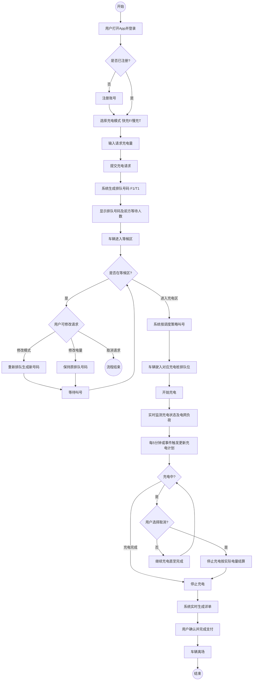

###### 图1客户充电活动图

#### 管理员管理的流程

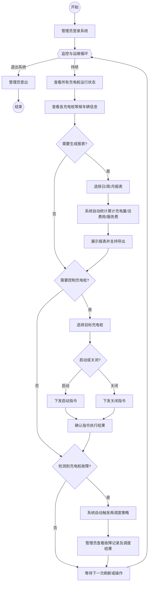

###### 图2管理员管理活动图

### 领域模型

#### 概念类

1. 角色类

用户（User）

管理员（Admin）

2. 物理实体类

充电站（ChargingStation）

等候区（WaitingArea）

充电区（ChargingArea）

充电桩（ChargingPile）

快充桩（FastChargingPile）

慢充桩（SlowChargingPile）

3. 业务实体类

排队号（QueueTicket）

充电请求（ChargingRequest）

充电会话（ChargingSession）

详单（Invoice）

计费策略（TariffPolicy）

报表（Report）

4. 事件 / 行为记录类

故障事件（FaultEvent）

调度重排记录（RescheduleRecord）

#### 类之间的关系

###### 表1概念类关系表

| 类1 | 类2 | 关系 | 说明 |
| --- | --- | --- | --- |
| 充电站 | 等候区 | 组合 | 充电站包含一个等候区 |
| 充电站 | 充电区 | 组合 | 充电站包含一个充电区 |
| 充电区 | 充电桩 | 组合 | 充电区包含多个充电桩 |
| 等候区 | 排队号 | 关联 | 等候区管理多个排队号 |
| 充电桩 | 排队号 | 关联 | 每个桩后有排队队列（排队号） |
| 用户 | 充电请求 | 关联 | 用户发起充电请求 |
| 充电请求 | 排队号 | 一对一 | 每个请求生成一个排队号 |
| 排队号 | 充电会话 | 关联 | 排队号被叫号后生成会话 |
| 充电会话 | 充电桩 | 关联 | 会话占用一个充电桩 |
| 充电会话 | 详单 | 一对一 | 每次会话生成一张详单 |
| 充电会话 | 计费策略 | 依赖 | 计费时使用策略 |
| 详单 | 用户 | 关联 | 详单归属于用户 |
| 管理员 | 充电桩 | 关联 | 管理员可控制/查看充电桩 |
| 管理员 | 充电站 | 关联 | 管理员管理充电站 |
| 故障事件 | 充电桩 | 关联 | 故障发生在某个桩 |
| 故障事件 | 排队号 | 关联 | 故障影响某些排队号 |
| 故障事件 | 调度重排记录 | 一对一 | 故障触发一次重排记录 |
| 调度重排记录 | 排队号 | 关联 | 重排涉及一组排队号 |
| 管理员 | 报表 | 关联 | 管理员可以查看报表 |
| 报表 | 充电站 | 依赖 | 报表统计充电站的数据 |
| 报表 | 充电会话 | 依赖 | 报表基于会话生成统计 |
| 报表 | 详单 | 依赖 | 报表基于详单生成收益统计 |

#### 类图

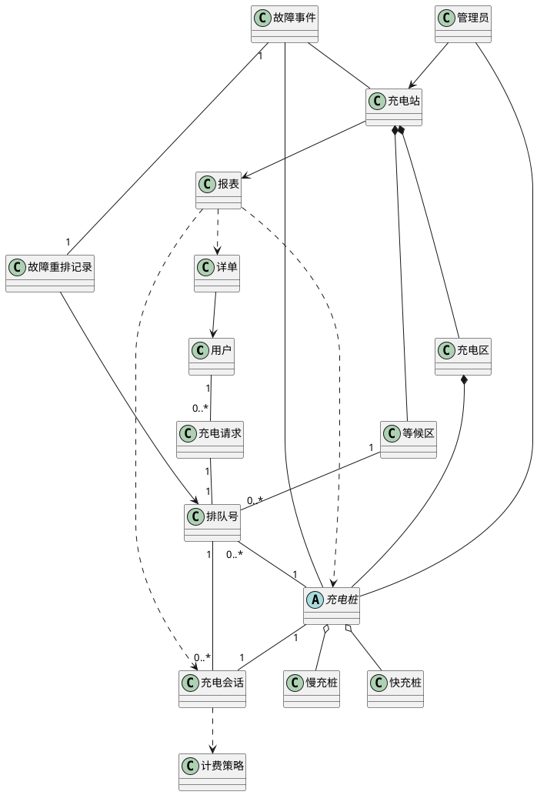

###### 图3系统领域模型

## 第二章：用例模型

### 用例图

#### 识别角色

###### 表2系统使用角色表

| 角色名称 | 与系统之间的关系说明 |
| --- | --- |
| 用户 (User) | 系统的服务对象。 用户通过移动App客户端提交充电需求、监控充电过程、接收系统调度指令并完成费用支付。 |
| 系统管理员 (Admin) | 系统的运营者。 管理员通过管理端监控充电桩物理状态、查看实时排队数据、下发设备控制指令并分析运营报表。并在自动算法失效或硬件故障时进行人工介入调度。 |

#### 识别用例

用户端用例

###### 表3用户端用例表

| 编号 | 用例名称 | 交互场景说明 | 关系说明 |
| --- | --- | --- | --- |
| UC101 | 提交充电请求 | 用户到达等候区，在App选择充电模式（快充F/慢充T）并输入目标电量，系统分配排队号。 | 主用例 |
| UC102 | 修改充电请求 | 用户在等待期间通过App修改模式或电量。系统若检测到模式改变，则触发重新排号逻辑。 | <<extend>> UC101 (可选分支) |
| UC103 | 查看排队信息 | 用户实时查询当前的排队号码，以及本模式下前方的等待车辆数量。 | 独立用例 |
| UC104 | 查看充电状态 | 车辆进入充电区并开始充电后，用户实时获取当前已充电量、当前功率及预计完成时间。 | 需与“充电桩”交互 |
| UC105 | 结束充电并支付 | 用户主动或被动（充满）结束服务，系统跳转支付界面。用户完成支付后，订单正式关闭。 | <<include>> UC106 |
| UC106 | 查看充电详单 | 系统展示详单编号、电费、服务费、总费用及启停时间等明细供用户确认。 | 被包含用例 |

系统管理员端用例

###### 表4系统管理员端用例表

| 编号 | 用例名称 | 交互场景说明 | 关系说明 |
| --- | --- | --- | --- |
| UC201 | 监控充电桩状态 | 管理员在后台实时查看所有桩的在线情况、累计充电次数、总运行时间及是否有故障告警。 | 需与“充电桩”交互 |
| UC202 | 控制充电桩启停 | 管理员针对维护需要或突发状况，远程向物理充电桩下发启动或关闭指令。 | 需与“充电桩”交互 |
| UC203 | 查看排队车辆信息 | 管理员查询当前在等候区等待的车辆明细，包括用户ID、电池容量、已排队时长等。 | 独立用例 |
| UC204 | 查看运营统计报表 | 管理员在管理界面打开并浏览生成的图形化或表格化经营数据报表。 | <<include>> UC205 |
| UC205 | 生成运营统计报表 | 管理员设定时间周期（日/周/月），系统自动汇总累计充电量、总收益、服务费等数据。 | 被包含用例 |
| UC206 | 处理异常桩调度 | 当充电桩反馈故障告警时，管理员确认故障，系统自动触发针对受影响车辆的“再调度”流程，将车辆引导至其他排队位。 | 异常分支用例 |
| UC207 | 执行人工调度干预 | 管理员手动调整等候区车辆的优先级或指派特定车辆进入特定桩位，覆盖系统的自动分配逻辑。 | 管理权限用例 |

#### 用例图

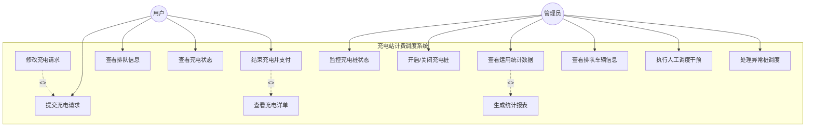

###### 图4充电站调度系统用例图

### 系统顺序图及操作契约

#### UC_101（提交充电请求）

系统顺序图

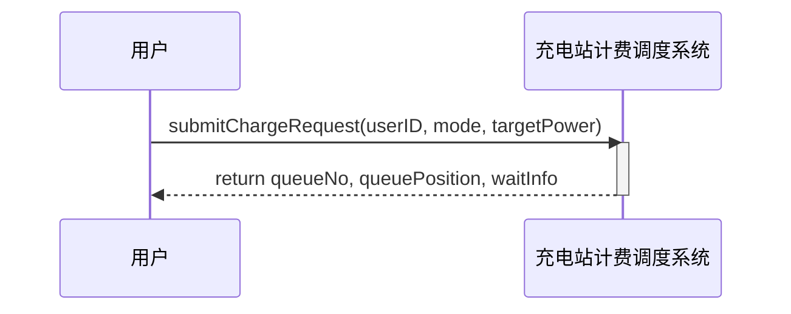

###### 图5提交充电请求用例对应的SSD

操作契约

###### 表5提交充电请求的操作契约

| 系统事件 | submitChargeRequest(userID, mode, targetPower) |
| --- | --- |
| 交叉引用 | UC101：提交充电请求 |
| 前置条件 | 用户已完成系统登录，身份合法；
用户未处于充电中 / 已排队状态；
充电站系统服务正常，等候区队列可正常接入 |
| 后置条件 | 创建ChargingRequest对象，赋值 userID、mode、targetPower、requestTime
创建QueueTicket排队号对象，赋值 queueNo、queuePosition、status = 等待
建立关联：
- User 1—* ChargingRequest
- ChargingRequest 1—1 QueueTicket
- QueueTicket *—1 WaitingArea |

#### UC_102（修改充电请求）

系统顺序图

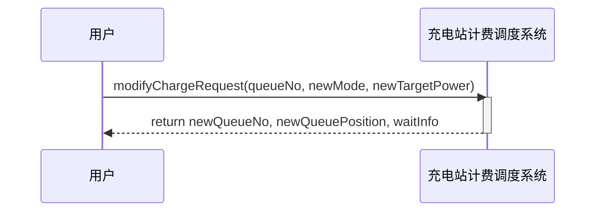

###### 图6修改充电请求用例对应的SSD

操作契约

###### 表6修改充电请求的操作契约

| 系统事件 | modifyChargeRequest(queueNo, newMode, newTargetPower) |
| --- | --- |
| 交叉引用 | UC102：修改充电请求 |
| 前置条件 | 用户持有有效排队号，已提交充电请求；
用户仍处于等候区（未进入充电区、未开始充电）；
3. 系统服务正常，队列可正常操作 |
| 后置条件 | 修改充电模式
- 原QueueTicket状态置为失效，解除与原 WaitingArea 关联
- 新建QueueTicket，加入新模式队列，建立新关联
- 更新ChargingRequest.mode
- 创建ModifyLog修改日志，记录原号、新号、时间
仅修改电量
- 更新ChargingRequest.targetPower
- QueueTicket与所有关联保持不变
- 记录修改日志 |

#### UC_103（查看排队信息）

系统顺序图

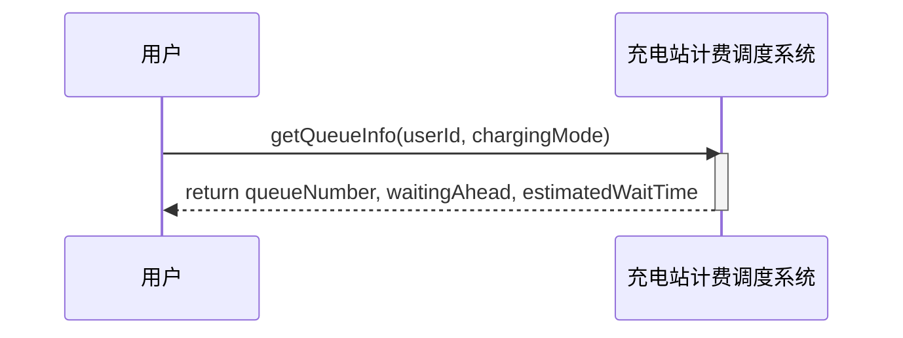

###### 图7查看排队信息用例对应的SSD

操作契约

###### 表7查看排队信息的操作契约

| 系统事件 | getQueueInfo(userId, chargingMode) |
| --- | --- |
| 交叉引用 | UC103：查看排队信息 |
| 前置条件 | 用户已通过身份验证，存在与chargingMode对应的等待队列。 |
| 后置条件 | 1. 根据充电模式（快充F/慢充T）定位到对应的等待队列对象。2. 根据用户ID定位到用户的排队对象，获取排队号码。3. 计算该模式下该用户前方等待的车辆数量。4. 根据前方车辆的总预估充电时间，计算预估等待时间。5. 将排队号码、前方等待数量、预估等待时间返回给用户。 |

#### UC_104（查看充电状态）

系统顺序图

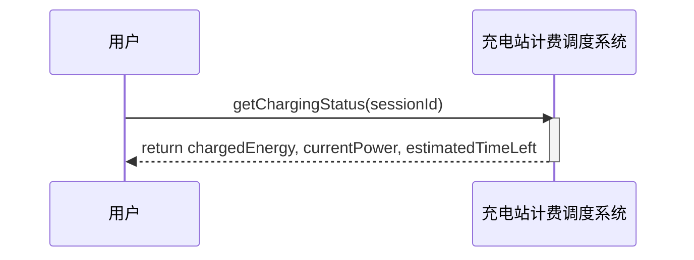

###### 图8查看充电状态用例对应的SSD

操作契约

###### 表8查看充电状态的操作契约

| 系统事件 | getChargingStatus(sessionId) |
| --- | --- |
| 交叉引用 | UC104：查看充电状态 |
| 前置条件 | 存在与sessionId对应的活跃充电会话，且会话关联的充电桩处于工作状态。 |
| 后置条件 | 1. 根据sessionId定位到充电会话对象。2. 根据请求总电量与当前电量计算预计剩余时间。3. 将已充电量、当前功率、预计剩余时间返回给用户。 |

#### UC_105（结束充电并支付）

系统顺序图

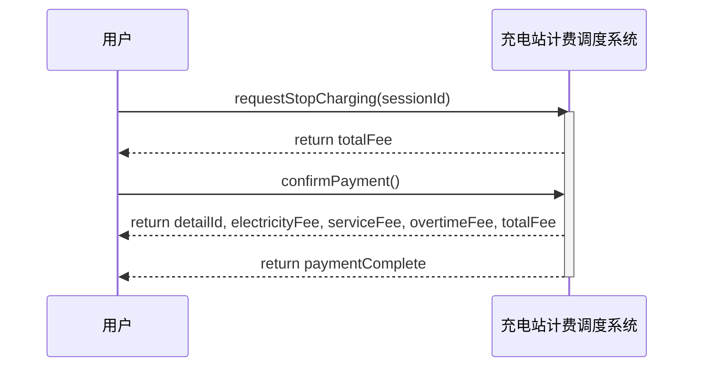

###### 图9结束支付并充电用例对应的SSD

操作契约

###### 表9结束充电并支付的操作契约（1）

| 系统事件 | requestStopCharging(sessionId) |
| --- | --- |
| 交叉引用 | UC105：结束充电并支付 |
| 前置条件 | 存在与sessionId对应的充电对话对象，且状态为“充电中”。 |
| 后置条件 | 1. 定位充电对话对象，将其状态设置为“结束中”。2. 记录结束时间。3. 系统内部向对应充电桩发送停止指令。4. 根据充电对话的开始时间、结束时间、实际充电量，调用计费策略（分时电价、服务费、超时费）计算总费用。5. 创建一个支付订单对象，状态为“待支付”。6. 将总费用返回给用户。 |

###### 表10结束充电并支付的操作契约（2）

| 系统事件 | confirmPayment() |
| --- | --- |
| 交叉引用 | UC105：结束充电并支付 |
| 前置条件 | 存在一个状态为“待支付”的支付订单，且总费用已确定。 |
| 后置条件 | 1. 系统内部调用支付接口处理扣款。2. 扣款成功后，支付订单状态更新为“已支付”。3. 触发生成充电详情（包含UC106）：创建详单对象，填充详单编号、充电费、服务费、超时费、总费用。4. 将详单对象与充电对话、支付订单关联。5. 关闭充电对话，释放充电桩资源。6. 将充电详情数据（详单编号、充电费、服务费、超时费、总费用）返回给用户。7. 返回支付完成信息。 |

#### UC_106（查看充电详单）

系统顺序图

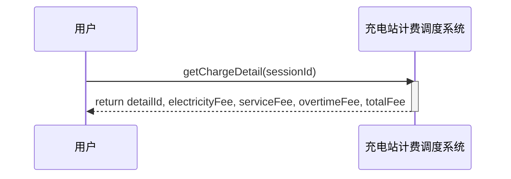

###### 图10查看充电详单用例对应的SSD

操作契约

###### 表11查看充电详单的操作契约

| 系统事件 | getChargeDetail(sessionId) |
| --- | --- |
| 交叉引用 | UC106：查看充电详情 |
| 前置条件 | 存在与sessionId对应的已结束的充电对话对象，且已生成详单。 |
| 后置条件 | 1. 根据sessionId定位到充电对话对象。2. 通过充电对话关联到详单对象。3. 从详单对象读取字段：详单编号、充电费、服务费、超时费、总费用。4. 将完整的详情信息返回给用户。 |

#### UC_201（监控充电桩状态）

系统顺序图

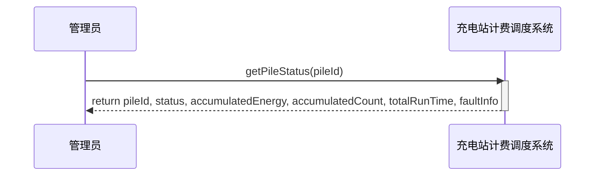

###### 图11监控充电桩状态用例对应的SSD

操作契约

###### 表12监控充电桩状态的操作契约

| 系统事件 | getPileStatus(pileId) |
| --- | --- |
| 交叉引用 | UC201：监控充电桩状态 |
| 前置条件 | 管理员已通过身份验证，指定的充电桩存在于系统中。 |
| 后置条件 | 根据pileId定位到充电桩对象。
向充电桩对象发送queryPileState(pileId)消息以获取实时状态。
接收充电桩返回的状态、累计充电量、累计次数、总运行时间、故障信息等数据。
4. 将充电桩状态信息返回给管理员。 |

#### UC_202（控制充电桩启停）

系统顺序图

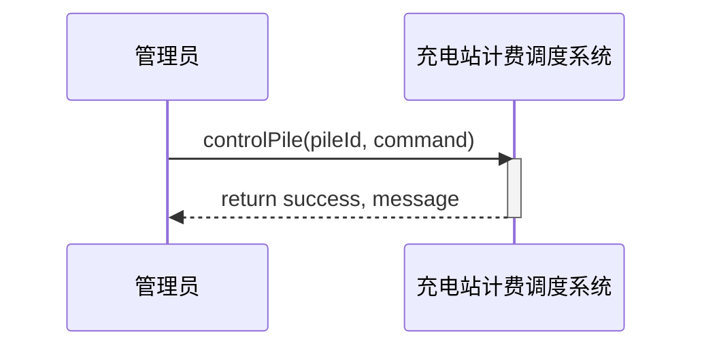

###### 图12控制充电桩启停用例对应的SSD

操作契约

###### 表13控制充电桩启停的操作契约

| 系统事件 | controlPile(pileId, command) |
| --- | --- |
| 交叉引用 | UC202：控制充电桩启停 |
| 前置条件 | 管理员已通过身份验证，指定的充电桩存在于系统中，command 为合法值（start/stop）。 |
| 后置条件 | 根据pileId定位到充电桩对象。
向充电桩对象发送sendPilotSignal(pileId, command)消息。
接收充电桩返回的执行结果。
根据执行结果更新充电桩对象的状态属性（如启动/关闭）。
5. 将控制结果返回给管理员。 |

#### UC_203（查看排队车辆信息）

系统顺序图

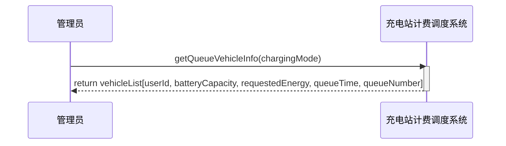

###### 图13查看排队车辆信息用例对应的SSD

操作契约

###### 表14查看排队车辆信息的操作契约

| 系统事件 | getQueueVehicleInfo(chargingMode) |
| --- | --- |
| 交叉引用 | UC203：查看排队车辆信息 |
| 前置条件 | 管理员已通过身份验证，chargingMode 为合法值（快充F/慢充T）。 |
| 后置条件 | 根据充电模式定位到对应的等待队列对象。
遍历队列中的所有排队对象。
对每个排队对象，获取关联的用户ID、车辆电池总容量、请求充电量、排队时长、排队号码。
将所有车辆信息汇总成列表。
5. 将排队车辆信息列表返回给管理员。 |

#### UC_204（查看运营统计报表）

系统顺序图

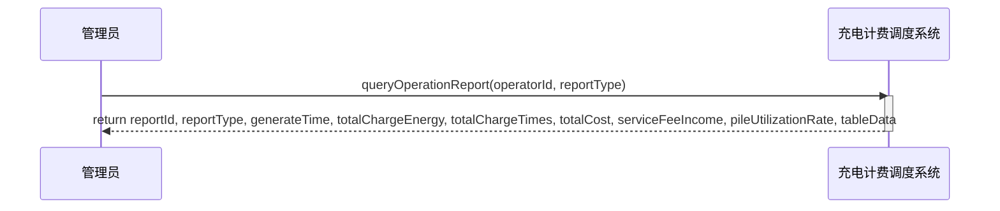

###### 图14查看运营统计报表用例对应的SSD

操作契约

###### 表15查看运营统计报表的操作契约

| 系统事件 | queryOperationReport(operatorId, reportType) |
| --- | --- |
| 交叉引用 | UC204：查看运营统计报表 |
| 前置条件 | 1.管理员身份合法，operatorId 对应系统中已存在的管理员领域对象
2.系统中已存在对应reportType的、已生成的报表领域对象 |
| 后置条件 | 系统向管理员返回完整的运营统计报表数据，包含报表ID、报表类型（日 / 周 / 月）、生成时间、累计充电量、累计充电次数、总费用、服务费收入、桩利用率 |

#### UC_205（生成运营统计报表）

系统顺序图

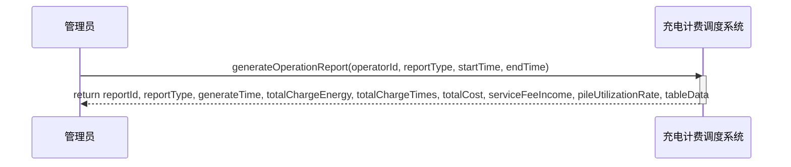

###### 图15生成运营统计报表用例对应的SSD

操作契约

###### 表16生成运营统计报表的操作契约

| 系统事件 | generateOperationReport(operatorId,reportType, startTime, endTime) |
| --- | --- |
| 交叉引用 | UC205：生成运营统计报表 |
| 前置条件 | 1.管理员身份合法，operatorId 对应系统中已存在的管理员领域对象
2.时间参数合法：startTime < endTime，且时间范围在系统业务有效期内
3.系统中存在对应时间周期内的充电对话，详单，充电桩等原始业务数据 |
| 后置条件 | 1.系统创建一个新的计报表对象
2.新报表对象与管理员对象建立关联，与充电桩，充电会话与详单对象建立关联
3.报表对象的属性被赋值：累计充电量，累计充电次数，总费用，服务费收入，桩利用率
4.系统向管理员返回新生成的报表完整数据 |

#### UC_206（处理异常桩调度）

系统顺序图

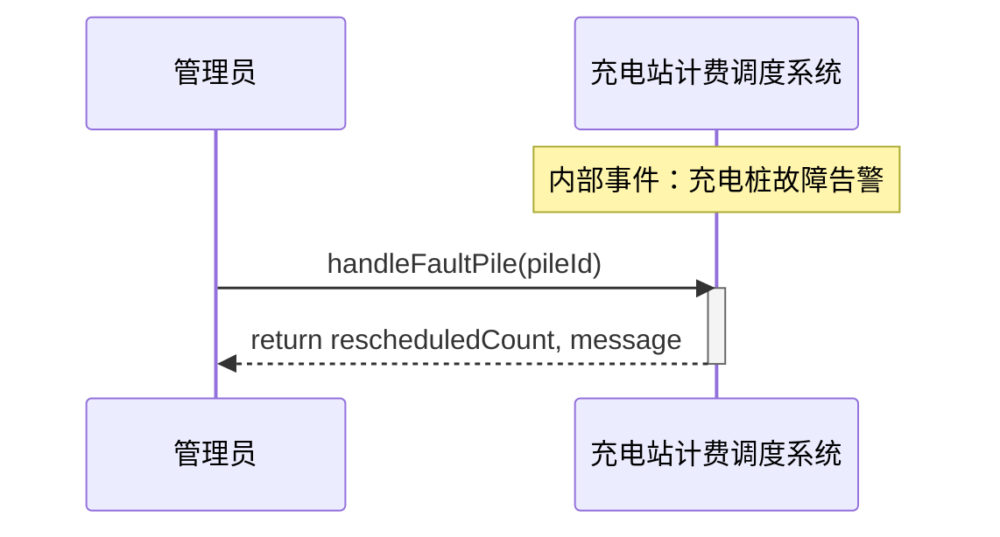

###### 图16处理异常桩调度用例对应的SSD

操作契约

###### 表17处理异常桩调度的操作契约

| 系统事件 | handleFaultPile(pileId) |
| --- | --- |
| 交叉引用 | UC206：处理异常桩调度 |
| 前置条件 | 管理员已通过身份验证，指定的充电桩处于故障状态，且该充电桩的等候队列中有车辆在排队。 |
| 后置条件 | 根据pileId定位到故障充电桩对象。
暂停等候区叫号服务。
获取故障充电桩等候队列中的所有车辆。
根据调度策略处理：
- 若采用优先级调度：当其它同类型充电桩队列有空位时，优先将故障队列车辆调入。
- 若采用时间顺序调度：将故障队列车辆与其他同类型充电桩中尚未充电的车辆合并，按排队号码先后顺序重新调度。
更新受影响车辆的状态和排队信息。
故障队列中全部车辆调度完毕后，重新开启等候区叫号服务。
7. 将调度结果（调度车辆数、消息）返回给管理员。 |

#### UC_207（执行人工调度干预）

系统顺序图

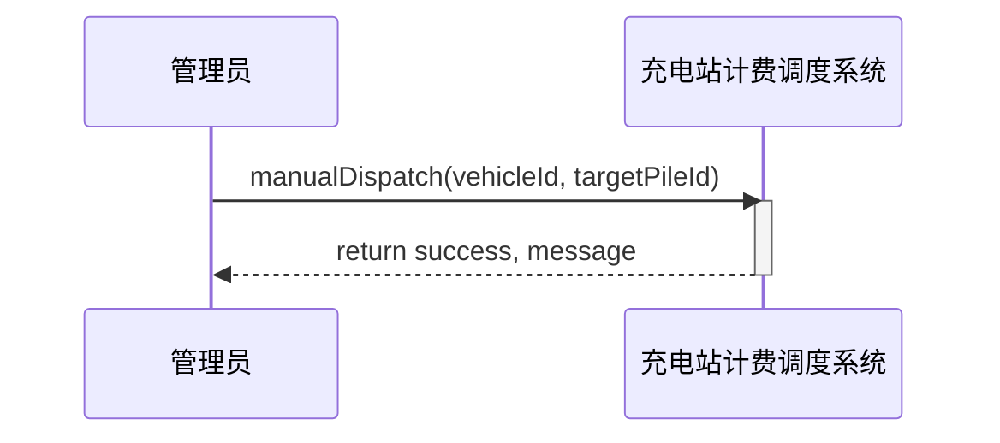

###### 图17执行人工调度干预用例对应的SSD

操作契约

###### 表18执行人工调度干预的操作契约

| 系统事件 | manualDispatch(vehicleId, targetPileId) |
| --- | --- |
| 交叉引用 | UC207：执行人工调度干预 |
| 前置条件 | 管理员已通过身份验证（具有管理权限），指定的车辆存在于等候区或充电区队列中，指定的目标充电桩存在且有空位或队列未满。 |
| 后置条件 | 根据vehicleId定位到车辆对象及其排队对象。
根据targetPileId定位到目标充电桩对象。
覆盖系统的自动分配逻辑：
- 将车辆从原队列中移除。
- 将车辆加入目标充电桩的等候队列。
- 更新车辆的排队号码和状态。
记录人工干预操作日志。
返回干预成功及消息给管理员。 |

## 工作量统计

正文：以表格的形式如实给出各个组员的工作内容及工作量描述；

###### 表19作业工作内容及工作量统计

|  |  | 工作量 | 王俊涛 | 李文睿 | 孙奥翔 | 郭峰 | 张云飞 |
| --- | --- | --- | --- | --- | --- | --- | --- |
| 领域模型 | 调研报告 | 2% |  |  |  |  |  |
|  | 核心业务介绍 | 3% |  |  |  |  |  |
|  | 活动图 | 10% |  |  |  |  |  |
|  | 类图 | 10% |  |  |  |  |  |
| 用例模型 | 角色识别 | 2% |  |  |  |  |  |
|  | 用例识别 | 5% |  |  |  |  |  |
|  | 用例图 | 8% |  |  |  |  |  |
| SSD以及对应操作契约 | UC101 | 5% |  |  |  |  |  |
|  | UC102 | 4% |  |  |  |  |  |
|  | UC103 | 4% |  |  |  |  |  |
|  | UC104 | 4% |  |  |  |  |  |
|  | UC105 | 5% |  |  |  |  |  |
|  | UC106 | 5% |  |  |  |  |  |
|  | UC201 | 4% |  |  |  |  |  |
|  | UC202 | 4% |  |  |  |  |  |
|  | UC203 | 3% |  |  |  |  |  |
|  | UC204 | 5% |  |  |  |  |  |
|  | UC205 | 4% |  |  |  |  |  |
|  | UC206 | 4% |  |  |  |  |  |
|  | UC207 | 4% |  |  |  |  |  |
| 管理与汇总 |  | 5% |  |  |  |  |  |
