> 封面图（原文档标题页，略）

智能充电桩调度计费系统概要设计

基于UML的面向对象建模方法

班级_小组：2023211303_G2

组长：王俊涛2023210952

组员1：李文睿2023210965

组员2：孙奥翔2023210958

组员3：张云飞2023210948

组员4：郭峰2023210950

日期：2026/6/7

## 软件架构

### 软件架构示意图

本系统采用Vue+Django+MySQL的前后端分离B/S架构，实现智能充电桩调度与计费管理。系统划分为用户界面层、控制器层、业务/应用层、持久化层、系统支持层和数据库层。各层职责清晰，确保系统高内聚、低耦合、易扩展。

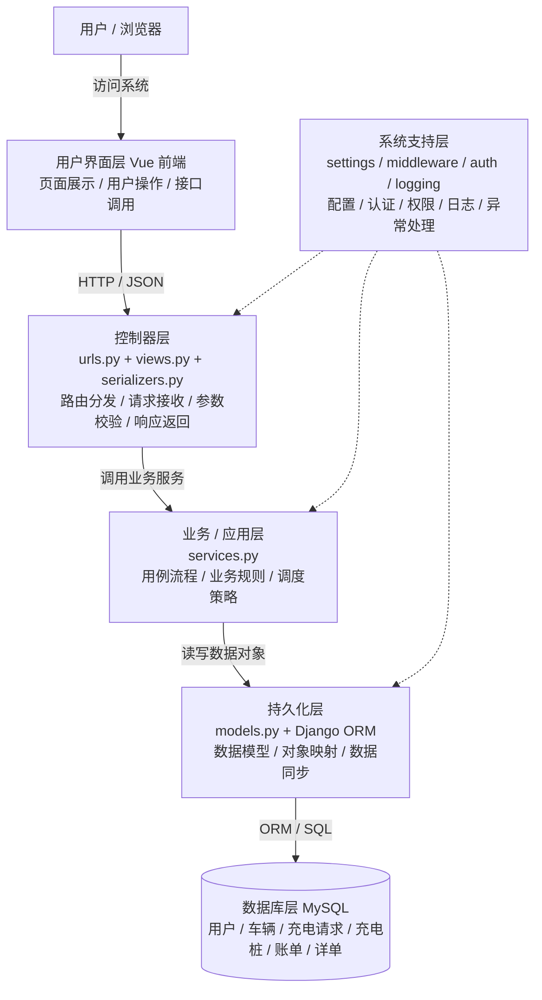
```mermaid
graph TD
    Browser[用户 / 浏览器] -->|访问系统| Vue[用户界面层 Vue 前端<br/>页面展示 / 用户操作 / 接口调用]
    Vue -->|HTTP / JSON| Controller[控制器层<br/>urls.py + views.py + serializers.py<br/>路由分发 / 请求接收 / 参数校验 / 响应返回]
    Controller -->|调用业务服务| Business[业务 / 应用层<br/>services.py<br/>用例流程 / 业务规则 / 调度策略]
    Business -->|读写数据对象| Persistence[持久化层<br/>models.py + Django ORM<br/>数据模型 / 对象映射 / 数据同步]
    Persistence -->|ORM / SQL| MySQL[(数据库层 MySQL<br/>用户 / 车辆 / 充电请求 / 充电桩 / 账单 / 详单)]
    Support[系统支持层<br/>settings / middleware / auth / logging<br/>配置 / 认证 / 权限 / 日志 / 异常处理]
    Support -.-> Controller
    Support -.-> Business
    Support -.-> Persistence
```

用户界面层（Vue前端）

提供注册、充电申请、账单/详单查询、充电桩管理、队列监控等功能的交互界面；仅负责采集用户输入和展示系统返回信息，不处理核心业务逻辑。

控制器层（Django Controller）

接收前端请求、参数校验、调用业务层服务、封装返回结果。

业务/应用层（Service）

实现充电申请、调度策略、计费计算、故障恢复等核心业务逻辑。

持久化层（Django ORM）

封装数据库访问，实现对象与数据库表映射；提供增删改查操作，保证数据一致性；隔离数据库细节。

系统支持层（Support Layer）

提供日志管理、缓存服务、任务调度、消息队列、安全与认证、监控与告警等功能，为业务层和控制器层提供全局通用支持，确保系统可靠运行。

数据库层（MySQL）

存储用户信息、车辆信息、充电请求记录、充电桩状态、账单和详单数据等；通过Django ORM与系统进行交互。

架构合理性

职责划分明确：每层关注自身功能，降低模块依赖，提高可维护性。

便于扩展：新增调度策略或计费规则时仅需修改业务层，不影响前端和数据库。

开发效率高：Django ORM自动完成对象与表映射，减少SQL开发工作量。

支持并发：前端与REST接口采用HTTP/JSON通信，可支持多用户同时访问。

系统可靠性：系统支持层提供日志、缓存、任务调度、消息队列和监控，保障业务连续性。

运行机制：

用户通过Vue前端发起请求；

Django控制器层接收请求并进行参数校验；

控制器调用业务层服务执行核心逻辑（调度、计费、状态更新）；

业务层通过ORM持久化数据到MySQL；

系统支持层提供日志、缓存、异步任务和监控等支持；

控制器层封装结果返回前端，完成一次请求-响应流程。

### 分层结构说明

本系统在 1.1 所示架构基础上，按照“界面展示—请求控制—业务处理—对象持久化—数据库存储”的链路划分职责。前端页面不直接访问数据库，也不承担核心业务计算；所有操作均以 HTTP/JSON 请求进入后端控制器，再由控制器委托业务服务、领域对象和持久化对象完成处理。

（1）接收前端请求的对象

Django 控制器层负责接收 Vue 前端请求。充电申请相关请求由 ChargingView 接收；账单与详单查询由 ViewBillController 接收；充电桩启停和参数设置由 RunChargingPileController 接收；状态监控由 ChargingPileMonitorController、ChargingQueueMonitorController 接收；故障调度由 FaultDispatchController 接收。控制器只负责路由匹配、身份认证、权限校验、参数检查和统一响应封装，不直接编写复杂业务规则。

（2）创建对象实例的对象

对象创建主要由业务服务层和领域模型层完成。ChargingService、BillingService、BillService、FaultDispatchService、FaultRecoveryService 等服务负责协调用例流程，并在需要时创建 ChargingRequest、QueueTicket、FaultRecord、ChargingDetail、Bill、PileStateDTO、QueueVehicleDTO 等对象；与充电桩状态紧密相关的 ChargingSession 可由 ChargingPile 发起创建，服务层负责协调和持久化。

（3）处理请求具体要求的对象

业务/应用层负责执行具体业务。ChargingService 处理充电申请、修改请求、开始充电和结束充电；ChargingStatusService 计算充电状态和临时详单；BillingService、BillService 完成计费与账单汇总；ChargingPileService 处理充电桩启停、运行状态和计费参数；监控服务负责统计充电桩与队列状态；FaultDispatchService 结合优先级调度、时间顺序调度和正常调度策略完成故障迁移与恢复。

（4）数据同步和存储的对象

数据同步由 Django ORM、Model 以及必要的 DAO/Repository 对象完成，最终持久化到 MySQL。主要持久化对象包括 User、Vehicle、ChargingRequest、ChargingSession、ChargingPile、QueueTicket、WaitingArea、TariffPolicy、TimePeriod、ChargingDetail、Bill/Invoice、FaultRecord 等。对于结束充电、生成详单、故障迁移等跨对象操作，应通过事务保证充电状态、队列调整和账单数据的一致性。

综上，系统一次典型请求的处理流程为：Vue 前端发起请求，控制器层完成入口处理，业务/应用层调用领域模型和策略对象，持久化层通过 ORM 将结果同步到 MySQL，最后控制器将处理结果以 JSON 形式返回前端。

## 系统动态结构设计

### 用例:UC_充电申请

#### 已知条件

| 指令 | 返回 |  |
| --- | --- | --- |
| 1、提交充电申请 | E_chargingRequest(car_Id, Request_Amount, Request_Mode) | Return(car_position, car_state, queue_Num, request_time) |
| 2、修改充电量 | Modify_Amount(car_Id, Amount) | Return(0/1) |
| 3、修改充电模式 | Modify_Mode(car_Id, Mode) | Return(0/1) |
| 4、查看队列状态 | Query_Car_State(car_id) | Return(car_Number_before_position, car_state, queue_Num, request_time) |
| 5、开始充电 | Start_Charging(car_id, ChargePileNum) | Return(0/1) |
| 6、查看充电状态 | Query_Charging_State(car_id) | Return(详单信息，具体参数详见需求说明） |
| 7、结束充电 | End_Charging(car_id, ChargingPileNum) | Return(0/1) |

#### 对象设计：E_chargingRequest

操作契约

| 系统事件 | E_chargingRequest(car_Id, Request_Amount, Request_Mode) |
| --- | --- |
| 前置条件 | 车辆账号有效、未存在未完成充电申请，Request_Amount>0，Request_Mode为快充或慢充。 |
| 后置条件 | 创建ChargingRequest，初始化请求时间、充电模式、目标电量和状态；
把ChargingRequest和等候区、Car关联；
更新Car的isIdle属性。 |

问题1：第一个接收消息的软件对象

Django的ChargingView视图类，是后端接收Vue前端请求的第一个入口对象。

问题2：负责创建对象实例的对象

ChargingService业务服务类，负责创建ChargingRequest模型实例。

问题3：对象关联关系建立

建立ChargingRequest与WaitingArea的关联关系；

建立ChargingRequest与Car的关联关系。

问题4：需要修改/初始化属性的对象

初始化ChargingRequest实例属性：car_id、request_amount、request_mode、request_time、car_state、queue_num、car_position；

更新Car的属性isIdle为false。

交互图

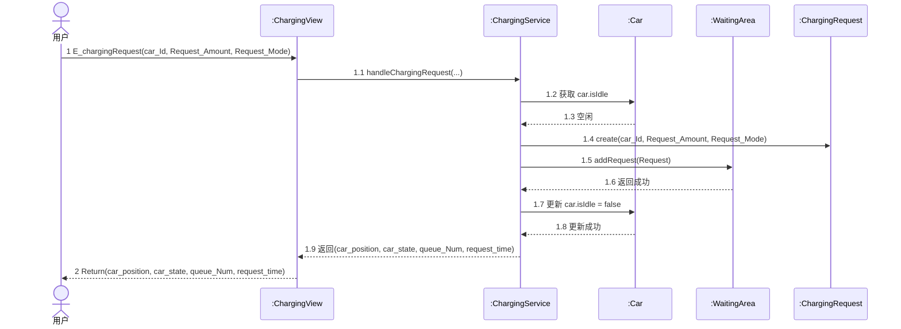
```mermaid
sequenceDiagram
    actor User as 用户
    participant View as :ChargingView
    participant Service as :ChargingService
    participant Car as :Car
    participant Wait as :WaitingArea
    participant Req as :ChargingRequest
    User->>View: 1 E_chargingRequest(car_Id, Request_Amount, Request_Mode)
    View->>Service: 1.1 handleChargingRequest(...)
    Service->>Car: 1.2 获取 car.isIdle
    Car-->>Service: 1.3 空闲
    Service->>Req: 1.4 create(car_Id, Request_Amount, Request_Mode)
    Service->>Wait: 1.5 addRequest(Request)
    Wait-->>Service: 1.6 返回成功
    Service->>Car: 1.7 更新 car.isIdle = false
    Car-->>Service: 1.8 更新成功
    Service-->>View: 1.9 返回(car_position, car_state, queue_Num, request_time)
    View-->>User: 2 Return(car_position, car_state, queue_Num, request_time)
```

#### 对象设计：Modify_Amount

操作契约

| 系统事件 | Modify_Amount(car_Id, Amount) |
| --- | --- |
| 前置条件 | 车辆存在排队中的ChargingRequest；
若车辆已经开始充电，则只允许修改未充电部分且不得小于已充电量。 |
| 后置条件/属性修改 | 修改ChargingRequest.requestAmount；
重新计算剩余充电时长和队列排序影响； |

问题1：第一个接收消息的软件对象

Django的ChargingView视图类，是后端接收Vue前端请求的第一个入口对象。

问题2：负责创建对象实例的对象

无新实例创建，仅查询并修改已有ChargingRequest模型对象。

问题3：对象关联关系建立

保持原有关联不变。

问题4：需要修改/初始化属性的对象

修改ChargingRequest的Request_Amount属性；充电中时校验新电量>当前已充电量。

交互图

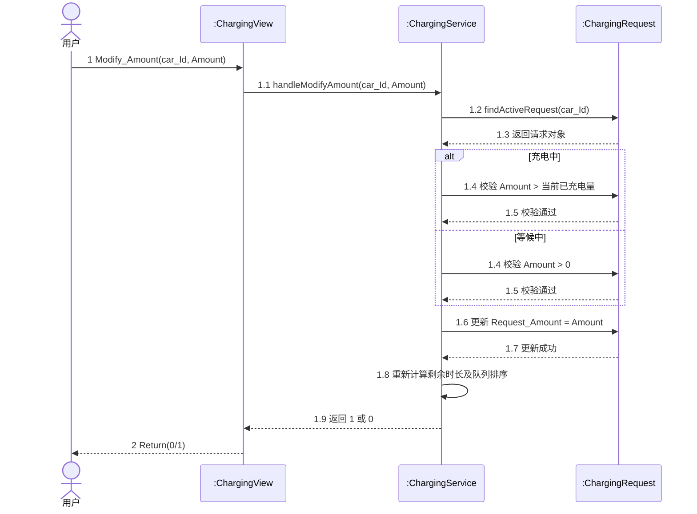
```mermaid
sequenceDiagram
    actor User as 用户
    participant View as :ChargingView
    participant Service as :ChargingService
    participant Req as :ChargingRequest
    User->>View: 1 Modify_Amount(car_Id, Amount)
    View->>Service: 1.1 handleModifyAmount(car_Id, Amount)
    Service->>Req: 1.2 findActiveRequest(car_Id)
    Req-->>Service: 1.3 返回请求对象
    alt 充电中
        Service->>Req: 1.4 校验 Amount > 当前已充电量
        Req-->>Service: 1.5 校验通过
    else 等候中
        Service->>Req: 1.4 校验 Amount > 0
        Req-->>Service: 1.5 校验通过
    end
    Service->>Req: 1.6 更新 Request_Amount = Amount
    Req-->>Service: 1.7 更新成功
    Service->>Service: 1.8 重新计算剩余时长及队列排序
    Service-->>View: 1.9 返回 1 或 0
    View-->>User: 2 Return(0/1)
```

#### 对象设计：Modify_Mode

操作契约

| 系统事件 | Modify_Mode(car_Id, Mode) |
| --- | --- |
| 前置条件 | 车辆存在尚未开始充电的申请；
目标Mode为快充或慢充；
车辆未进入正在充电状态。 |
| 后置条件/属性修改 | 修改ChargingRequest.requestMode；
从原队列移出并加入等候区，重置位置。 |

问题1：第一个接收消息的软件对象

Django的ChargingView视图类，是后端接收Vue前端请求的第一个入口对象。

问题2：负责创建对象实例的对象

无新实例创建。

问题3：对象关联关系建立

解除ChargingRequest与原队列的关联；

建立ChargingRequest与等候区的关联。

问题4：需要修改/初始化属性的对象

修改ChargingRequest模型的request_mode属性；

重置ChargingRequest的car_position；

修改ChargeQueue模型：原队列移除车辆。

交互图

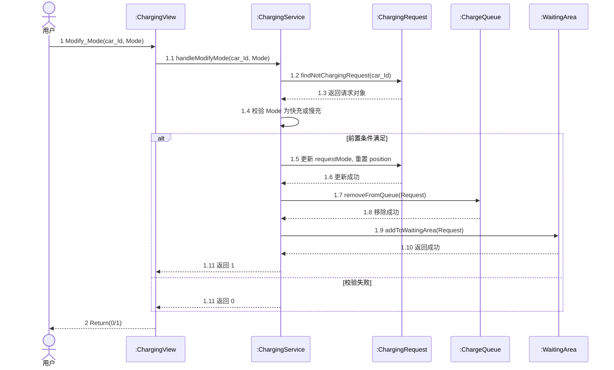
```mermaid
sequenceDiagram
    actor User as 用户
    participant View as :ChargingView
    participant Service as :ChargingService
    participant Req as :ChargingRequest
    participant Queue as :ChargeQueue
    participant Wait as :WaitingArea
    User->>View: 1 Modify_Mode(car_Id, Mode)
    View->>Service: 1.1 handleModifyMode(car_Id, Mode)
    Service->>Req: 1.2 findNotChargingRequest(car_Id)
    Req-->>Service: 1.3 返回请求对象
    Service->>Service: 1.4 校验 Mode 为快充或慢充
    alt 前置条件满足
        Service->>Req: 1.5 更新 requestMode, 重置 position
        Req-->>Service: 1.6 更新成功
        Service->>Queue: 1.7 removeFromQueue(Request)
        Queue-->>Service: 1.8 移除成功
        Service->>Wait: 1.9 addToWaitingArea(Request)
        Wait-->>Service: 1.10 返回成功
        Service-->>View: 1.11 返回 1
    else 校验失败
        Service-->>View: 1.11 返回 0
    end
    View-->>User: 2 Return(0/1)
```

#### 对象设计：Query_Car_State

操作契约

| 系统事件 | Query_Car_State(car_id) |
| --- | --- |
| 前置条件 | 用户已登录；
car_id对应车辆存在；
车辆已经提交充电请求；
当前车辆处于排队相关状态，即waiting或queued；
若车辆已经开始充电或已经结束充电，则不属于该指令的正常查询范围。 |
| 后置条件 | 不创建或删除对象；
不建立或消除对象之间的关联；
不修改领域对象属性；
系统读取ChargingRequest中的car_state、queue_Num、request_time；
若car_state=waiting，计算同模式等候区中排在当前车辆前面的车辆数；
若car_state=queued，计算同一充电桩队列中排在当前车辆前面的车辆数； |

问题1：第一个接收该消息的软件对象是什么？

Django的ChargingView视图类，是后端接收Vue前端请求的第一个入口对象。

问题2：该操作是否需要创建新的对象实例？

不需要。该指令是查询型操作，只读取当前车辆的充电请求和队列状态，不创建新的实例。

问题3：哪些对象之间需要建立或消除关联关系？

不需要建立或消除新的关联。查询过程只利用已有的ChargingRequest与队列信息。

问题4：哪个对象的属性需要修改或初始化？

不修改领域对象属性。ChargingQueueService只根据ChargingRequest.car_state判断车辆是在等候区还是充电桩队列中，并计算car_Number_before_position。

交互图

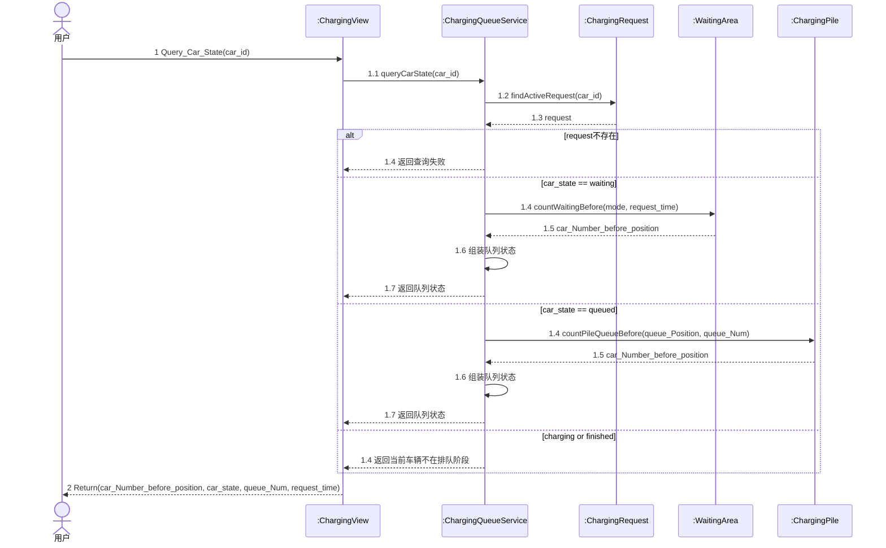
```mermaid
sequenceDiagram
    actor User as 用户
    participant View as :ChargingView
    participant Service as :ChargingQueueService
    participant Req as :ChargingRequest
    participant Wait as :WaitingArea
    participant Pile as :ChargingPile
    User->>View: 1 Query_Car_State(car_id)
    View->>Service: 1.1 queryCarState(car_id)
    Service->>Req: 1.2 findActiveRequest(car_id)
    Req-->>Service: 1.3 request
    alt request不存在
        Service-->>View: 1.4 返回查询失败
    else car_state == waiting
        Service->>Wait: 1.4 countWaitingBefore(mode, request_time)
        Wait-->>Service: 1.5 car_Number_before_position
        Service->>Service: 1.6 组装队列状态
        Service-->>View: 1.7 返回队列状态
    else car_state == queued
        Service->>Pile: 1.4 countPileQueueBefore(queue_Position, queue_Num)
        Pile-->>Service: 1.5 car_Number_before_position
        Service->>Service: 1.6 组装队列状态
        Service-->>View: 1.7 返回队列状态
    else charging or finished
        Service-->>View: 1.4 返回当前车辆不在排队阶段
    end
    View-->>User: 2 Return(car_Number_before_position, car_state, queue_Num, request_time)
```

#### 对象设计：Start_Charging

操作契约

| 操作 | Start_Charging(car_id, ChargePileNum) |
| --- | --- |
| 前置条件 | 用户已登录；
car_id 对应车辆存在；
车辆已经被调度进入充电区；
ChargingRequest.car_state = queued；
ChargingRequest.queue_Position = ChargePileNum；
车辆位于该充电桩队列首位；
7. 充电桩处于可工作状态。 |
| 后置条件 | 创建新的 ChargingSession 实例；
建立 ChargingSession 与 ChargingRequest 的关联；
建立 ChargingSession 与 ChargingPile 的关联；
消除车辆对应 QueueTicket 与充电桩等待队列的队首等待关系；
修改 ChargingRequest.car_state = charging；
初始化 ChargingSession.startTime、ChargingSession.chargeAmount = 0 等属性；
7. 若成功返回 1，否则返回 0。 |

问题1：第一个接收该消息的软件对象是什么？

该消息由用户端发起，因此第一个接收该消息的软件对象为控制器层对象 ChargingView。ChargingView 接收请求后，将开始充电的业务逻辑委托给 ChargingService。

问题2：根据操作契约，哪个对象负责创建 ChargingSession 实例？

开始充电时创建的新实例是 ChargingSession，它表示一次真实的充电过程。根据创建者模式，ChargingPile 记录当前正在服务的会话，并且拥有创建会话所需的充电桩编号、功率、队首车辆等信息，因此由 ChargingPile 负责创建或发起创建 ChargingSession 更合理。ChargingService 负责协调流程，不直接承担领域对象创建职责。

问题3：哪些对象之间需要建立或消除关联关系？

需要建立 ChargingSession 与 ChargingPile 的关联，表示该会话占用某个充电桩；同时建立 ChargingSession 与 ChargingRequest 的关联，表示该会话来源于某个充电请求。车辆开始充电后，对应 QueueTicket 从充电桩等待队列中移除。

问题4：哪个对象的属性需要修改或初始化？

ChargingSession 初始化 startTime、chargeAmount、status 等属性。ChargingRequest.car_state 由 queued 修改为 charging。ChargingPile.currentSession 修改为当前新建的 ChargingSession。

交互图

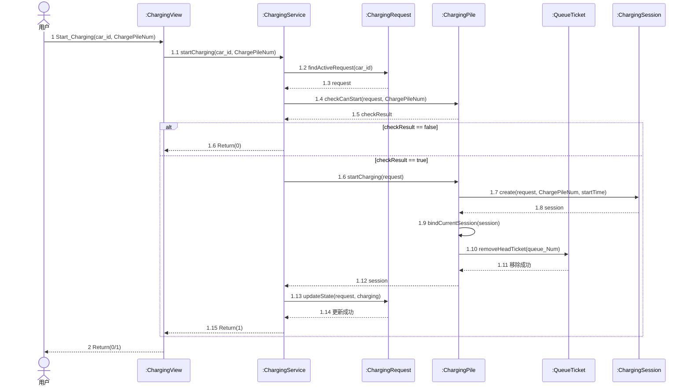
```mermaid
sequenceDiagram
    actor User as 用户
    participant View as :ChargingView
    participant Service as :ChargingService
    participant Req as :ChargingRequest
    participant Pile as :ChargingPile
    participant Ticket as :QueueTicket
    participant Session as :ChargingSession
    User->>View: 1 Start_Charging(car_id, ChargePileNum)
    View->>Service: 1.1 startCharging(car_id, ChargePileNum)
    Service->>Req: 1.2 findActiveRequest(car_id)
    Req-->>Service: 1.3 request
    Service->>Pile: 1.4 checkCanStart(request, ChargePileNum)
    Pile-->>Service: 1.5 checkResult
    alt checkResult == false
        Service-->>View: 1.6 Return(0)
    else checkResult == true
        Service->>Pile: 1.6 startCharging(request)
        Pile->>Session: 1.7 create(request, ChargePileNum, startTime)
        Session-->>Pile: 1.8 session
        Pile->>Pile: 1.9 bindCurrentSession(session)
        Pile->>Ticket: 1.10 removeHeadTicket(queue_Num)
        Ticket-->>Pile: 1.11 移除成功
        Pile-->>Service: 1.12 session
        Service->>Req: 1.13 updateState(request, charging)
        Req-->>Service: 1.14 更新成功
        Service-->>View: 1.15 Return(1)
    end
    View-->>User: 2 Return(0/1)
```

#### 对象设计：Query_Charging_State

操作契约

| 操作 | Query_Charging_State(car_id) |
| --- | --- |
| 前置条件 | 用户已登录；
car_id 对应车辆存在；
车辆已经开始充电或已经完成充电；
系统中存在与该车辆对应的 ChargingSession；
5. 若车辆已完成充电，则系统中应存在对应的 Invoice。 |
| 后置条件 | 查询过程中不创建或删除 ChargingSession；
查询过程中不建立或消除领域对象关联；
若车辆正在充电，系统根据 ChargingSession、ChargingPile 和 TariffPolicy 计算临时详单信息；
若车辆已结束充电并生成详单，则读取 Invoice 中的正式详单信息；
不修改车辆状态；
6. 返回详单信息，至少包括：详单编号、详单生成时间、充电桩编号、充电电量、充电时长、启动时间、停止时间、充电费用、服务费用、总费用。 |

问题1：第一个接收该消息的软件对象是什么？

该消息由用户端发起，因此第一个接收消息的软件对象统一为控制器层对象 ChargingView。它接收 Query_Charging_State(car_id) 后，将具体查询与计算逻辑委托给 ChargingStatusService。

问题2：根据操作契约，该操作是否需要创建新的对象实例？

不需要。该指令本质上是查询型指令。如果车辆正在充电，系统返回的是根据当前会话实时计算得到的临时详单信息；如果车辆已完成充电，则读取已生成的 Invoice。查询本身不创建新的 ChargingSession 或 Invoice。

问题3：哪些对象之间需要建立或消除关联关系？

不需要建立或消除新的关联。该操作只读取已有的 ChargingSession 与 ChargingPile 关联，或者读取已有的 ChargingSession 与 Invoice 关联。

问题4：哪个对象的属性需要修改或初始化？

该操作不修改领域对象属性。ChargingStatusService 只负责计算临时详单字段，例如 ChargeDuration、ChargeFee、ServiceFee 和 TotalFee。

交互图

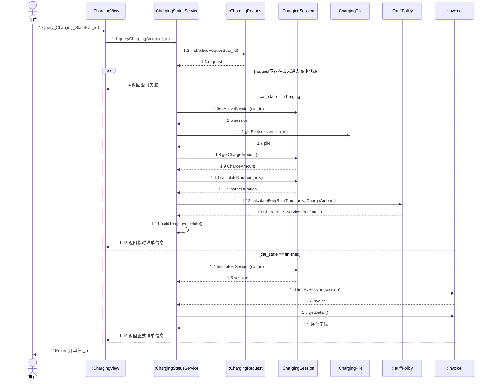
```mermaid
sequenceDiagram
    actor User as 用户
    participant View as :ChargingView
    participant Service as :ChargingStatusService
    participant Req as :ChargingRequest
    participant Session as :ChargingSession
    participant Pile as :ChargingPile
    participant Tariff as :TariffPolicy
    participant Invoice as :Invoice
    User->>View: 1 Query_Charging_State(car_id)
    View->>Service: 1.1 queryChargingState(car_id)
    Service->>Req: 1.2 findActiveRequest(car_id)
    Req-->>Service: 1.3 request
    alt request不存在或未进入充电状态
        Service-->>View: 1.4 返回查询失败
    else car_state == charging
        Service->>Session: 1.4 findActiveSession(car_id)
        Session-->>Service: 1.5 session
        Service->>Pile: 1.6 getPile(session.pile_id)
        Pile-->>Service: 1.7 pile
        Service->>Session: 1.8 getChargeAmount()
        Session-->>Service: 1.9 ChargeAmount
        Service->>Session: 1.10 calculateDuration(now)
        Session-->>Service: 1.11 ChargeDuration
        Service->>Tariff: 1.12 calculateFee(StartTime, now, ChargeAmount)
        Tariff-->>Service: 1.13 ChargeFee, ServiceFee, TotalFee
        Service->>Service: 1.14 buildTempInvoiceInfo()
        Service-->>View: 1.15 返回临时详单信息
    else car_state == finished
        Service->>Session: 1.4 findLatestSession(car_id)
        Session-->>Service: 1.5 session
        Service->>Invoice: 1.6 findBySession(session)
        Invoice-->>Service: 1.7 invoice
        Service->>Invoice: 1.8 getDetail()
        Invoice-->>Service: 1.9 详单字段
        Service-->>View: 1.10 返回正式详单信息
    end
    View-->>User: 2 Return(详单信息)
```

#### 对象设计：End_Charging

操作契约

| 操作名称 | End_Charging |
| --- | --- |
| 前置条件 | 存在一个与 carId 和 pileId 匹配的正在充电的充电请求，且充电桩处于工作状态 |
| 后置条件 | 1. 该充电请求的状态变为“已完成”
2. 生成一条充电详单记录，包含实际充电量、起止时间、费用等
3. 充电详单被持久化保存
4. 该充电请求从充电桩的队列中移除
5. 根据调度策略为等候区中匹配模式的下一辆车叫号并加入队列 |

问题1：哪个对象应该作为第一个接收系统事件的控制器？

根据“控制器”模式，本操作属于“充电申请”用例，因此由 ChargingApplicationController 负责接收。该控制器负责协调充电申请相关的所有系统事件。

问题2：哪个对象负责停止充电并计算实际充电量？

“信息专家”模式：充电桩本身拥有充电开始时间、功率等信息，能够计算出实际充电量和结束时间。故由 充电桩 对象执行 stopCharging(req)。

问题3：哪个对象负责生成充电详单？

计费服务 BillingService 拥有电价规则和费用计算逻辑，是生成详单的信息专家。由 ChargingApplicationController 调用 billing.generateChargingDetail(...)。

问题4：生成详单后，谁负责持久化？

引入持久化层对象 ChargingDetailDAO，由控制器调用 detailDAO.insert(detail) 完成数据库插入。

问题5：哪个对象负责修改充电请求的状态？

充电请求对象自身拥有状态属性，由控制器发送 setStatus("已完成") 消息。

问题6：如何从队列中移除该请求？

充电桩聚合了一个队列，队列负责管理请求列表。由控制器调用 queue.remove(req)。

问题7：如何调度下一辆车？

根据策略模式，控制器调用 SchedulingStrategy.schedule()，调度策略会从等候区获取匹配模式的第一个请求，并加入有空位的同类型充电桩队列。

交互图

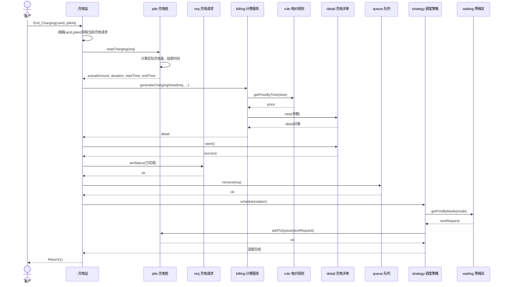
```mermaid
sequenceDiagram
    actor Customer as 客户
    participant Station as :充电站
    participant Pile as pile:充电桩
    participant Req as req:充电请求
    participant Billing as billing:计费服务
    participant Rule as rule:电价规则
    participant Detail as detail:充电详单
    participant Queue as queue:队列
    participant Strategy as strategy:调度策略
    participant Waiting as waiting:等候区
    Customer->>Station: End_Charging(carId, pileId)
    Station->>Station: 根据carId,pileId获取当前充电请求
    Station->>Pile: stopCharging(req)
    Pile->>Pile: 计算实际充电量、结束时间
    Pile-->>Station: actualAmount, duration, startTime, endTime
    Station->>Billing: generateChargingDetail(req, ...)
    Billing->>Rule: getPriceByTime(time)
    Rule-->>Billing: price
    Billing->>Detail: new(参数)
    Detail-->>Billing: detail对象
    Billing-->>Station: detail
    Station->>Detail: save()
    Detail-->>Station: success
    Station->>Req: setStatus(已完成)
    Req-->>Station: ok
    Station->>Queue: remove(req)
    Queue-->>Station: ok
    Station->>Strategy: schedule(station)
    Strategy->>Waiting: getFirstByMode(mode)
    Waiting-->>Strategy: nextRequest
    Strategy->>Pile: addToQueue(nextRequest)
    Pile-->>Strategy: ok
    Strategy-->>Station: 调度完成
    Station-->>Customer: Return(1)
```

### 用例:UC_查看账单

#### 已知条件

| 指令 | 返回 |  |
| --- | --- | --- |
| 1、查看账单申请 | Request_Bill(carId, date) | Return(carId, date, Bill_Id, ChargePileNum, ChargeAmount, ChargeDuration, StartTime, EndTime, TotalChargeFee, TotalServiceFee, TotalFee) |

#### 对象设计：Request_Bill

操作契约

| 操作名称 | Request_Bill |
| --- | --- |
| 前置条件 | 客户已登录，车辆存在 |
| 后置条件 | 返回一个 Bill 对象，包含该车辆在指定日期内的充电详单汇总信息（总充电量、总时长、总费用等） |

问题1：控制器选择

本操作属于“查看账单”用例，因此由 ViewBillController 接收。

问题2：谁负责查询充电详单？

持久化层对象 ChargingDetailDAO 负责根据车ID和日期查询数据库，返回详单列表。

问题3：谁负责汇总生成账单？

引入 BillService 服务类，它根据详单列表计算总充电量、总费用等，生成 Bill 对象（Bill 可以是一个简单的值对象，或直接返回汇总数据）。

问题4：是否需要持久化？

不需要，本操作仅为查询。

交互图

```mermaid
sequenceDiagram
    actor Customer as 客户
    participant Station as :充电站
    participant Details as details:充电详单
    Customer->>Station: Request_Bill(carId, date)
    Station->>Details: findByCarIdAndDate(carId, date)
    Details->>Details: 查询所有匹配的详单
    Details-->>Station: List<充电详单>
    Station->>Station: 汇总计算总费用、总电量等
    Station-->>Customer: Return(bill)
```

### 用例:UC_查看详单（子）

#### 已知条件

| 指令 | 返回 |  |
| --- | --- | --- |
| 1、查看详单申请 | Request_DetailedList(Bill_Id) | Return(carId, date, Bill_Id, ChargePileNum, ChargeAmount, ChargeDuration, StartTime, EndTime, ChargeFee, ServiceFee, subtotalFee) |

#### 对象设计：Request_DetailedList

操作契约

| 操作名称 | Request_DetailedList |
| --- | --- |
| 前置条件 | 存在对应的详单ID |
| 后置条件 | 返回一个完整的 ChargingDetail 对象，包含所有字段（详单编号、充电桩编号、充电量、时长、起止时间、费用等） |

问题1：控制器选择

同一用例，仍由 ViewBillController 接收。

问题2：谁负责查询单个详单？

ChargingDetailDAO 根据主键 findById 返回详单对象。

问题3：是否需要额外处理？

直接返回 DAO 查询结果即可，无需业务逻辑。

交互图

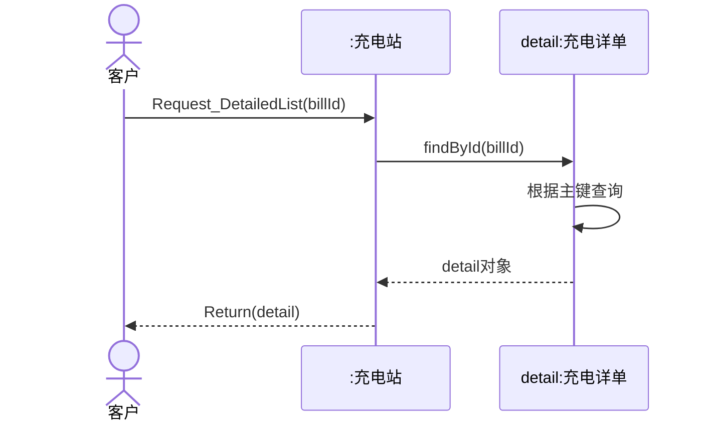
```mermaid
sequenceDiagram
    actor Customer as 客户
    participant Station as :充电站
    participant Detail as detail:充电详单
    Customer->>Station: Request_DetailedList(billId)
    Station->>Detail: findById(billId)
    Detail->>Detail: 根据主键查询
    Detail-->>Station: detail对象
    Station-->>Customer: Return(detail)
```

### 用例:UC_运行充电桩

#### 已知条件

| 指令 | 返回 |  |
| --- | --- | --- |
| 1、启动充电桩 | powerOn(pile_Id) | Return(0/1) |
| 2、设置参数 | setParameters(计费规则，三个时段的电价数据等） | Return(0/1) |
| 3、运行充电桩 | Start_ChargingPile(pile_Id) | Return(0/1) |
| 4、关闭充电桩 | powerOff(pile_Id) | Return(0/1) |

#### 对象设计：powerOn

操作契约：

| 系统事件 | powerOn(pile_Id) |
| --- | --- |
| 前置条件 | 系统管理员已通过身份认证；pile_Id 对应的 ChargingPile 存在；充电桩未处于故障锁定状态。 |
| 后置条件 | 若物理设备上电成功，ChargingPile.power_state=ON，working_state="待机"，经 ORM 持久化；失败则 Return(0) |

问题1：该消息进入系统后，由哪个对象第一个接收？Vue 管理端 AdminClient 发起 HTTP 请求；RunChargingPileController（views.py）作为本用例控制器接收并校验参数。

问题2：由哪个对象负责创建实例？本事件不新建 Model 实例；ChargingPileService通过 ChargingPile.objects.get(pile_id=pile_Id)定位已有记录

问题3：对象之间如何建立关联？ChargingStation 与 ChargingPile 在 models.py 中通过外键保持聚合关系；Service 校验桩归属后更新状态

问题4：哪些对象的属性需要修改或初始化？成功时：pile.power_state=ON，pile.working_state="待机"；调用pile.save() 经 ORM 写回 MySQL

问题5：还有哪些对象参与协作？由 ChargingPile Model + Django ORM 完成查询与 save()

交互图：

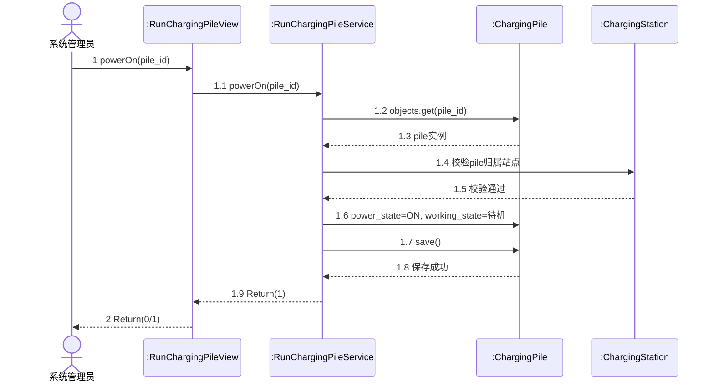
```mermaid
sequenceDiagram
    actor Admin as 系统管理员
    participant View as :RunChargingPileView
    participant Service as :RunChargingPileService
    participant Pile as :ChargingPile
    participant Station as :ChargingStation
    Admin->>View: 1 powerOn(pile_id)
    View->>Service: 1.1 powerOn(pile_id)
    Service->>Pile: 1.2 objects.get(pile_id)
    Pile-->>Service: 1.3 pile实例
    Service->>Station: 1.4 校验pile归属站点
    Station-->>Service: 1.5 校验通过
    Service->>Pile: 1.6 power_state=ON, working_state=待机
    Service->>Pile: 1.7 save()
    Pile-->>Service: 1.8 保存成功
    Service-->>View: 1.9 Return(1)
    View-->>Admin: 2 Return(0/1)
```

#### 对象设计：setParameters

操作契约：

| 系统事件 | setParameters |
| --- | --- |
| 前置条件 | 管理员已认证；计费规则、时段边界和电价合法；峰/平/谷覆盖计费周期。 |
| 后置条件 | 创建/更新 TariffPolicy 与 TimePeriod；ChargingStation 关联新规则；BillingService 切换规则；各 ChargingPile 绑定规则；ORM 持久化成功 Return(1) |

问题1：该消息进入系统后，由哪个对象第一个接收？RunChargingPileController（views.py）接收 setParameters 请求

问题2：由哪个对象负责创建实例？ChargingPileService 调用 `TariffPolicy.objects.update_or_create()` 创建/更新规则；`TimePeriod.objects.create()` 创建三个时段

问题3：对象之间如何建立关联？models.py 中 TariffPolicy 与 TimePeriod 为一对多外键；ChargingStation、ChargingPile 外键指向 TariffPolicy

问题4：哪些对象的属性需要修改或初始化？TariffPolicy 的 service_price 等；TimePeriod 的 start_time、end_time、price；ChargingPile 的 tariff_policy 外键

问题5：参数校验与持久化由谁完成？Service 调用 Model 的 save()/update()，ORM 自动生成 SQL 同步至 MySQL；BillingService（service.py） 更新内存中的当前计费策略

交互图：

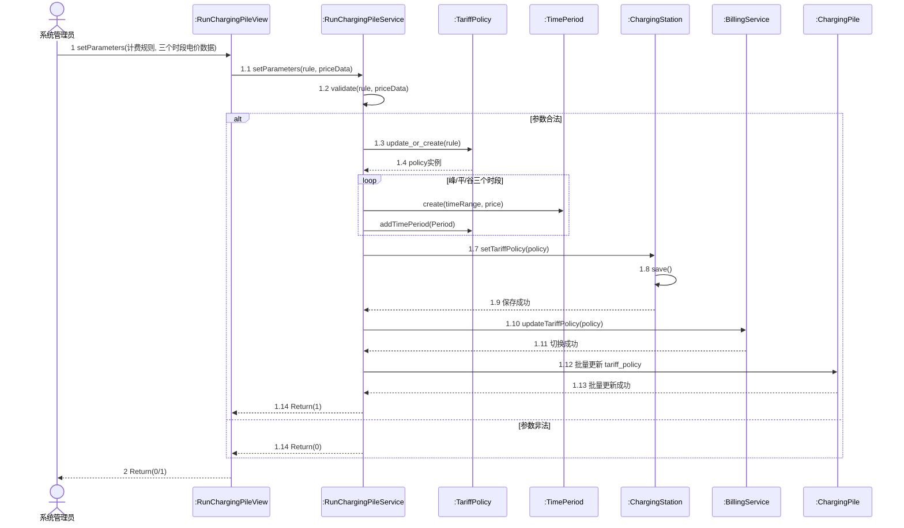
```mermaid
sequenceDiagram
    actor Admin as 系统管理员
    participant View as :RunChargingPileView
    participant Service as :RunChargingPileService
    participant Tariff as :TariffPolicy
    participant Period as :TimePeriod
    participant Station as :ChargingStation
    participant Billing as :BillingService
    participant Pile as :ChargingPile
    Admin->>View: 1 setParameters(计费规则, 三个时段电价数据)
    View->>Service: 1.1 setParameters(rule, priceData)
    Service->>Service: 1.2 validate(rule, priceData)
    alt 参数合法
        Service->>Tariff: 1.3 update_or_create(rule)
        Tariff-->>Service: 1.4 policy实例
        loop 峰/平/谷三个时段
            Service->>Period: create(timeRange, price)
            Service->>Tariff: addTimePeriod(Period)
        end
        Service->>Station: 1.7 setTariffPolicy(policy)
        Station->>Station: 1.8 save()
        Station-->>Service: 1.9 保存成功
        Service->>Billing: 1.10 updateTariffPolicy(policy)
        Billing-->>Service: 1.11 切换成功
        Service->>Pile: 1.12 批量更新 tariff_policy
        Pile-->>Service: 1.13 批量更新成功
        Service-->>View: 1.14 Return(1)
    else 参数非法
        Service-->>View: 1.14 Return(0)
    end
    View-->>Admin: 2 Return(0/1)
```

#### 对象设计：Start_ChargingPile

操作契约：

| 系统事件 | Start_ChargingPile(pile_Id) |
| --- | --- |
| 前置条件 | ChargingPile 已上电、无故障、已绑定 TariffPolicy |
| 后置条件 | working_state=RUNNING；PileMonitorScheduler 注册监控；ORM 持久化成功 Return(1) |

问题1：该消息进入系统后，由哪个对象第一个接收？RunChargingPileController（views.py）

问题2：由哪个对象负责创建实例？不新建 Model；PileMonitorScheduler（系统支持层）注册定时任务。

问题3：对象之间如何建立关联？ChargingPileService 调用 pile.can_start() 检查上电、故障、计费参数。

问题4：哪些对象的属性需要修改或初始化？pile.working_state=RUNNING；pile.save()经 ORM 持久化

交互图：

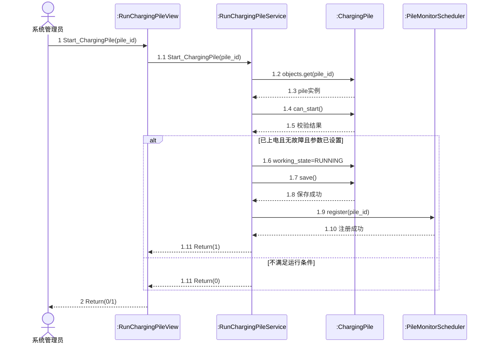
```mermaid
sequenceDiagram
    actor Admin as 系统管理员
    participant View as :RunChargingPileView
    participant Service as :RunChargingPileService
    participant Pile as :ChargingPile
    participant Scheduler as :PileMonitorScheduler
    Admin->>View: 1 Start_ChargingPile(pile_id)
    View->>Service: 1.1 Start_ChargingPile(pile_id)
    Service->>Pile: 1.2 objects.get(pile_id)
    Pile-->>Service: 1.3 pile实例
    Service->>Pile: 1.4 can_start()
    Pile-->>Service: 1.5 校验结果
    alt 已上电且无故障且参数已设置
        Service->>Pile: 1.6 working_state=RUNNING
        Service->>Pile: 1.7 save()
        Pile-->>Service: 1.8 保存成功
        Service->>Scheduler: 1.9 register(pile_id)
        Scheduler-->>Service: 1.10 注册成功
        Service-->>View: 1.11 Return(1)
    else 不满足运行条件
        Service-->>View: 1.11 Return(0)
    end
    View-->>Admin: 2 Return(0/1)
```

#### 对象设计：powerOff

操作契约：

| 系统事件 | powerOff(pile_Id) |
| --- | --- |
| 前置条件 | 系统管理员已通过身份认证；pile_Id 对应的 ChargingPile 存在；充电桩无正在进行的 ChargingSession，或已由其他用例完成停止充电与结算。 |
| 后置条件 | power_state=OFF，working_state="关闭"；注销监控；ORM 持久化成功 Return(1)。 |

问题1：该消息进入系统后，由哪个对象第一个接收？RunChargingPileController（views.py）

问题2：由哪个对象负责创建实例？本事件不创建新的 Model 实例。ChargingPileService（service.py）通过ChargingPile.objects.get(pile_id=pile_Id)获取已有充电桩记录；通过ChargingSession.objects.filter(pile=pile, status="充电中").exists()查询是否存在活跃会话，用于判断能否安全下电。

问题3：对象之间如何建立关联？ChargingSession与ChargingPile在models.py中通过外键关联（ChargingSession.pile → ChargingPile）。若存在status="充电中"的 Session，说明该桩仍被占用，拒绝下电，关联保持不变；仅当exists()为 false 时才继续关闭流程。

问题4：哪些对象的属性需要修改或初始化？下电成功后：ChargingPile的power_state=OFF，working_state="关闭"；调用pile.save()经 Django ORM 写回 MySQL。PileMonitorScheduler注销该桩监控任务。ChargingSession 在本事件中不修改。

问题5：关闭失败时如何处理？以下情况均返回 Return(0)，pile 状态不变、不调用 save()：存在活跃 ChargingSession；PileDeviceAdapter 下电失败；ORM 持久化异常。RunChargingPileController将结果封装为 JSON 响应返回前端。

交互图：

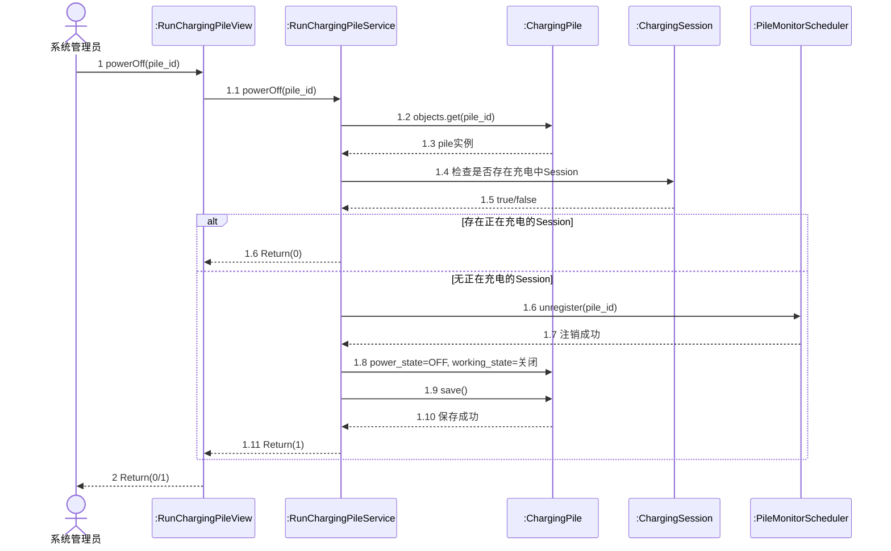
```mermaid
sequenceDiagram
    actor Admin as 系统管理员
    participant View as :RunChargingPileView
    participant Service as :RunChargingPileService
    participant Pile as :ChargingPile
    participant Session as :ChargingSession
    participant Scheduler as :PileMonitorScheduler
    Admin->>View: 1 powerOff(pile_id)
    View->>Service: 1.1 powerOff(pile_id)
    Service->>Pile: 1.2 objects.get(pile_id)
    Pile-->>Service: 1.3 pile实例
    Service->>Session: 1.4 检查是否存在充电中Session
    Session-->>Service: 1.5 true/false
    alt 存在正在充电的Session
        Service-->>View: 1.6 Return(0)
    else 无正在充电的Session
        Service->>Scheduler: 1.6 unregister(pile_id)
        Scheduler-->>Service: 1.7 注销成功
        Service->>Pile: 1.8 power_state=OFF, working_state=关闭
        Service->>Pile: 1.9 save()
        Pile-->>Service: 1.10 保存成功
        Service-->>View: 1.11 Return(1)
    end
    View-->>Admin: 2 Return(0/1)
```

### 用例:UC_查看充电桩状态

#### 已知条件

| 指令 | 返回 |  |
| --- | --- | --- |
| 1、查看充电桩状态 | Query_PileState(pile_Id) | Return(workingState, TotalChargeNum, TotalChargeTime, TotalCapacity) |

#### 对象设计：Query_PileState

操作契约：

| 系统事件 | Query_PileState(pile_Id) |
| --- | --- |
| 前置条件 | 1. 管理员已通过系统身份验证，具有充电桩监控权限；
2. 指定的充电桩pile_Id在系统中存在且已完成注册；
3. 系统与物理充电桩的通信链路正常，可获取实时状态数据；
4. 系统数据库中存在该充电桩的历史充电记录 |
| 后置条件 | 1. 系统根据pile_Id定位到对应的充电桩(ChargingPile)领域对象；
2. 向物理充电桩发送实时状态查询指令，获取并更新workingState属性；
3. 从充电会话(ChargingSession)表中统计该充电桩所有已完成会话的数量，赋值给TotalChargeNum；
4. 从充电会话(ChargingSession)表中统计该充电桩所有已完成会话的时长总和，赋值给TotalChargeTime；
5. 从充电会话(ChargingSession)表中统计该充电桩所有已完成会话的充电量总和，赋值给TotalCapacity；
6. 将上述四个字段封装为 JSON 格式返回给管理员客户端 |

问题1：第一个接收该消息的软件对象是谁？

第一个接收消息的是控制器层的 ChargingPileMonitorController。因为系统采用 Vue+Django 前后端分离架构，管理员在管理端点击 "查看充电桩状态" 按钮发送的 HTTP GET 请求，首先由 Django 框架的视图控制器接收，负责路由分发、参数合法性校验和管理员权限验证。

问题2：哪个对象负责创建对象的实例？

业务层的 ChargingPileMonitorService负责创建PileStateDTO对象的实例。因为数据传输对象 (DTO) 的组装属于业务层的职责，需要将从多个实体对象获取的数据整合为前端需要的统一格式。

问题3：哪些对象之间是如何建立关联关系的？

ChargingSession与ChargingPile通过pile_id字段建立多对一关联，表示该充电会话使用的充电桩；

PileStateDTO与ChargingPile通过pile_id字段建立一对一关联，表示该状态数据对应的充电桩。

问题4：哪个对象的属性需要修改或者初始化？

ChargingPile对象：workingState属性根据物理充电桩返回的实时数据进行更新；update_time属性更新为当前系统时间；

PileStateDTO对象：pileId、pileType、workingState、totalChargeNum、totalChargeTime、totalCapacity、updateTime等属性根据查询结果初始化；

本用例为查询为主的操作，仅更新充电桩的实时状态字段，不修改其他业务数据。

问题5：数据持久化对象的设计

所有模型层对象都负责数据持久化，通过 Django ORM 框架从 MySQL 数据库读取数据：

ChargingPileModel：从charging_pile表中查询指定pile_id的充电桩基本信息

ChargingSessionModel：从charging_session表中查询指定pile_id的所有已完成会话，并进行统计计算

交互图：

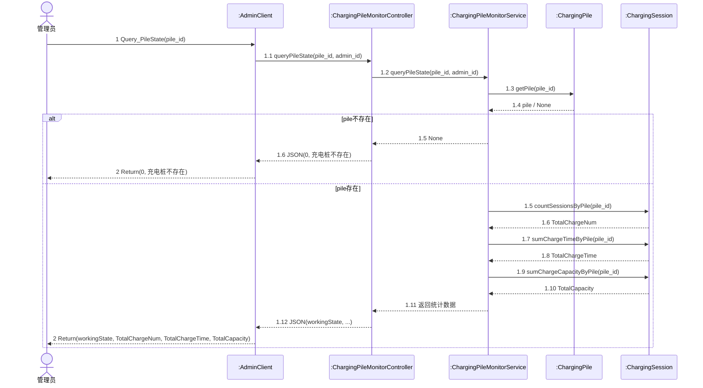
```mermaid
sequenceDiagram
    actor Admin as 管理员
    participant Client as :AdminClient
    participant Controller as :ChargingPileMonitorController
    participant Service as :ChargingPileMonitorService
    participant Pile as :ChargingPile
    participant Session as :ChargingSession
    Admin->>Client: 1 Query_PileState(pile_id)
    Client->>Controller: 1.1 queryPileState(pile_id, admin_id)
    Controller->>Service: 1.2 queryPileState(pile_id, admin_id)
    Service->>Pile: 1.3 getPile(pile_id)
    Pile-->>Service: 1.4 pile / None
    alt pile不存在
        Service-->>Controller: 1.5 None
        Controller-->>Client: 1.6 JSON(0, 充电桩不存在)
        Client-->>Admin: 2 Return(0, 充电桩不存在)
    else pile存在
        Service->>Session: 1.5 countSessionsByPile(pile_id)
        Session-->>Service: 1.6 TotalChargeNum
        Service->>Session: 1.7 sumChargeTimeByPile(pile_id)
        Session-->>Service: 1.8 TotalChargeTime
        Service->>Session: 1.9 sumChargeCapacityByPile(pile_id)
        Session-->>Service: 1.10 TotalCapacity
        Service-->>Controller: 1.11 返回统计数据
        Controller-->>Client: 1.12 JSON(workingState, ...)
        Client-->>Admin: 2 Return(workingState, TotalChargeNum, TotalChargeTime, TotalCapacity)
    end
```

### 用例:UC_查看队列状态（子）

#### 已知条件

| 指令 | 返回 |  |
| --- | --- | --- |
| 1、查看队列状态 | Query_QueueState(queuelist) | Return(car_Id, car_Capacity, Request_Amount, waitTime) |

#### 对象设计：Query_QueueState

操作契约：

| 系统事件 | Query_QueueState(pile_Id) |
| --- | --- |
| 前置条件 | 1. 管理员已通过系统身份验证，具有队列监控权限；
2. 该用例为UC_查看充电桩状态的子用例，仅在父用例执行过程中被调用；
3. 指定的充电桩pile_Id在系统中存在且已完成注册；
4. 该充电桩已关联对应的队列(Queue)领域对象；
5. 系统数据库中存在该队列的充电请求记录 |
| 后置条件 | 1. 系统根据pile_Id定位到对应的队列(Queue)领域对象；
2. 从充电请求(ChargingRequest)表中筛选出该队列中状态为 "排队中" 的所有请求；
3. 对每个充电请求，通过car_Id关联到车辆(Vehicle)对象，提取car_Capacity属性；
4. 从充电请求对象中提取Request_Amount和request_time属性；
5. 计算每个请求的waitTime = 当前系统时间 - request_time（单位：分钟）；
6. 将所有车辆信息按排队先后顺序（即request_time升序）汇总成列表；
7. 将列表封装为 JSON 格式返回给父用例（UC_查看充电桩状态），最终展示在管理员客户端 |

问题1：第一个接收该消息的软件对象是谁？

第一个接收消息的是控制器层的 ChargingQueueMonitorController。因为管理员在管理端点击 "查看队列" 按钮发送的 HTTP GET 请求，首先由 Django 框架的视图控制器接收，负责路由分发、参数合法性校验和管理员权限验证。

问题2：哪个对象负责创建对象的实例？

业务层的 ChargingQueueMonitorService负责创建QueueVehicleDTO对象的实例。因为需要将从ChargingRequest和Vehicle两个不同实体对象获取的数据整合为前端需要的统一车辆信息格式。

问题3：哪些对象之间是如何建立关联关系的？

Queue与ChargingPile通过pile_id字段建立一对一关联，表示该队列对应的充电桩

ChargingRequest与Queue通过queue_id字段建立多对一关联，表示该请求所属的队列

ChargingRequest与Vehicle通过car_id字段建立一对一关联，表示该请求对应的车辆

QueueVehicleDTO与ChargingRequest通过car_id字段建立一对一关联，表示该 DTO 对应的充电请求

问题4：哪个对象的属性需要修改或者初始化？

QueueVehicleDTO对象：carId、carCapacity、requestAmount、waitTime、queuePosition等属性根据查询结果初始化

本用例为纯查询操作，没有任何实体对象的属性需要修改

问题5：数据持久化对象的设计

所有模型层对象都负责数据持久化，通过 Django ORM 框架从 MySQL 数据库读取数据：

QueueModel：从queue表中查询指定pile_id对应的队列信息

ChargingRequestModel：从charging_request表中查询指定queue_id且状态为 "排队中" 的所有请求

VehicleModel：从vehicle表中查询每个请求对应的车辆信息

交互图：

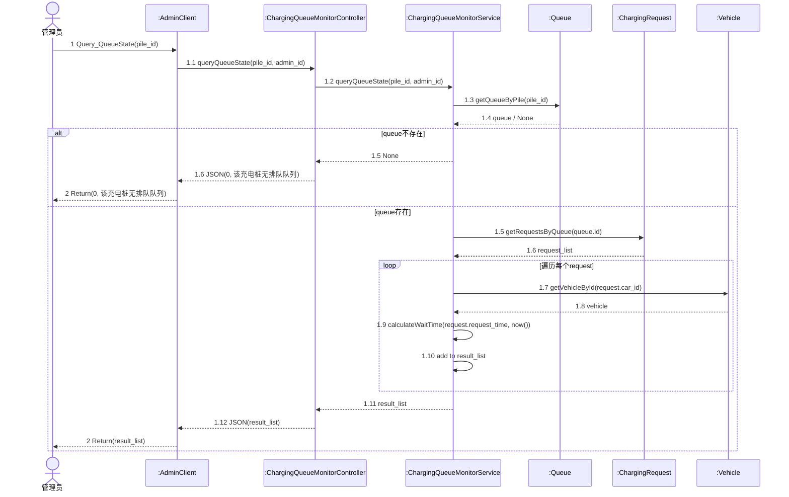
```mermaid
sequenceDiagram
    actor Admin as 管理员
    participant Client as :AdminClient
    participant Controller as :ChargingQueueMonitorController
    participant Service as :ChargingQueueMonitorService
    participant Queue as :Queue
    participant Req as :ChargingRequest
    participant Vehicle as :Vehicle
    Admin->>Client: 1 Query_QueueState(pile_id)
    Client->>Controller: 1.1 queryQueueState(pile_id, admin_id)
    Controller->>Service: 1.2 queryQueueState(pile_id, admin_id)
    Service->>Queue: 1.3 getQueueByPile(pile_id)
    Queue-->>Service: 1.4 queue / None
    alt queue不存在
        Service-->>Controller: 1.5 None
        Controller-->>Client: 1.6 JSON(0, 该充电桩无排队队列)
        Client-->>Admin: 2 Return(0, 该充电桩无排队队列)
    else queue存在
        Service->>Req: 1.5 getRequestsByQueue(queue.id)
        Req-->>Service: 1.6 request_list
        loop 遍历每个request
            Service->>Vehicle: 1.7 getVehicleById(request.car_id)
            Vehicle-->>Service: 1.8 vehicle
            Service->>Service: 1.9 calculateWaitTime(request.request_time, now())
            Service->>Service: 1.10 add to result_list
        end
        Service-->>Controller: 1.11 result_list
        Controller-->>Client: 1.12 JSON(result_list)
        Client-->>Admin: 2 Return(result_list)
    end
```

### 充电桩故障调度

#### 已知条件

| 指令 | 返回 |  |
| --- | --- | --- |
| 1、优先级故障调度 | Priority_Fault_Dispatch(pile_Id) | Return(dispatchPlan, failedList) |
| 2、时间顺序故障调度 | TimeOrder_Fault_Dispatch(pile_Id) | Return(dispatchPlan, failedList) |
| 3、故障恢复调度 | Fault_Recovery_Dispatch(pile_Id) | Return(0/1, recoveredPileState, scheduledList) |

#### 对象设计：优先级调度

操作契约

| 操作 | Priority_Fault_Dispatch(pile_Id) |
| --- | --- |
| 前置条件 | 管理员或监控服务已通过认证；
pile_Id 对应 ChargingPile 存在；
该充电桩状态为 FAULT 或设备心跳异常；
系统能够读取该桩的当前 ChargingSession 和等待队列；
同模式可用充电桩存在空位，或等候区可接收未迁移车辆。 |
| 后置条件 | 创建或更新 FaultRecord，记录故障桩、故障类型和故障时间；
将 ChargingPile.working_state 修改为 FAULT，并停止该桩监控任务；
若存在正在充电的 ChargingSession，则中断会话并保存已充电量；
按“正在充电车辆优先、队首车辆优先、等待时间长者优先”的规则排序受影响请求；
对可迁移车辆创建新的 QueueTicket 并加入目标 ChargingPile 队列；
无法迁移的请求回到 WaitingArea，保持原 request_time；
7. 返回调度方案和失败列表。 |

问题1：第一个接收该消息的软件对象是什么？

该消息可能由 PileMonitorScheduler 自动触发，也可能由管理员在监控界面手动确认触发。进入系统后的第一个接收对象为控制器层 FaultDispatchController，它负责校验 pile_Id、故障状态和管理员/系统权限，并将业务处理委托给 FaultDispatchService。

问题2：根据操作契约，哪个对象负责创建对象实例？

FaultDispatchService 负责创建 FaultRecord 和新的 QueueTicket 实例。FaultRecord 用于记录故障事件；QueueTicket 用于表示车辆迁移到目标充电桩后的新排队位置。PriorityDispatchStrategy 只负责排序和选择方案，不直接持久化领域对象。

问题3：哪些对象之间需要建立或消除关联关系？

建立 FaultRecord 与故障 ChargingPile 的关联；建立新 QueueTicket 与目标 ChargingPile 的队列关联；建立 QueueTicket 与 ChargingRequest 的关联。车辆迁移后，需要消除旧 QueueTicket 与故障 ChargingPile 队列的关联。若车辆正在充电，还需要保留 ChargingSession 与 ChargingRequest 的历史关联，用于后续详单和补偿计算。

问题4：哪个对象的属性需要修改或者初始化？

ChargingPile 的 working_state 修改为 FAULT，is_available 修改为 false；ChargingSession 的 status 修改为 interrupted，并记录 end_time 与 charged_amount；ChargingRequest 的 car_state 根据迁移结果修改为 queued 或 waiting，同时更新 queue_Num、queue_Position；新 QueueTicket 初始化 queue_Num、queue_Position、sourcePileId、targetPileId 等字段。

问题5：优先级规则如何确定？

优先级调度采用稳定排序：正在充电且被中断的车辆优先级最高；故障前位于队首的车辆优先于队尾车辆；同一优先级下按 request_time 升序排列。这样既能保护已经开始服务的车辆，也能尽量保持原排队公平性。

交互图：

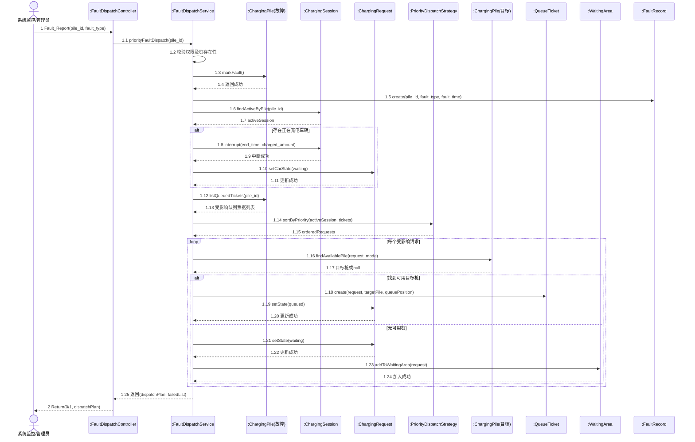
```mermaid
sequenceDiagram
    actor Admin as 系统监控/管理员
    participant Controller as :FaultDispatchController
    participant Service as :FaultDispatchService
    participant FaultPile as :ChargingPile(故障)
    participant Session as :ChargingSession
    participant Req as :ChargingRequest
    participant Strategy as :PriorityDispatchStrategy
    participant TargetPile as :ChargingPile(目标)
    participant Ticket as :QueueTicket
    participant Waiting as :WaitingArea
    participant Record as :FaultRecord
    Admin->>Controller: 1 Fault_Report(pile_id, fault_type)
    Controller->>Service: 1.1 priorityFaultDispatch(pile_id)
    Service->>Service: 1.2 校验权限及桩存在性
    Service->>FaultPile: 1.3 markFault()
    FaultPile-->>Service: 1.4 返回成功
    Service->>Record: 1.5 create(pile_id, fault_type, fault_time)
    Service->>Session: 1.6 findActiveByPile(pile_id)
    Session-->>Service: 1.7 activeSession
    alt 存在正在充电车辆
        Service->>Session: 1.8 interrupt(end_time, charged_amount)
        Session-->>Service: 1.9 中断成功
        Service->>Req: 1.10 setCarState(waiting)
        Req-->>Service: 1.11 更新成功
    end
    Service->>FaultPile: 1.12 listQueuedTickets(pile_id)
    FaultPile-->>Service: 1.13 受影响队列票据列表
    Service->>Strategy: 1.14 sortByPriority(activeSession, tickets)
    Strategy-->>Service: 1.15 orderedRequests
    loop 每个受影响请求
        Service->>TargetPile: 1.16 findAvailablePile(request_mode)
        TargetPile-->>Service: 1.17 目标桩或null
        alt 找到可用目标桩
            Service->>Ticket: 1.18 create(request, targetPile, queuePosition)
            Service->>Req: 1.19 setState(queued)
            Req-->>Service: 1.20 更新成功
        else 无可用桩
            Service->>Req: 1.21 setState(waiting)
            Req-->>Service: 1.22 更新成功
            Service->>Waiting: 1.23 addToWaitingArea(request)
            Waiting-->>Service: 1.24 加入成功
        end
    end
    Service-->>Controller: 1.25 返回(dispatchPlan, failedList)
    Controller-->>Admin: 2 Return(0/1, dispatchPlan)
```

#### 对象设计：时间顺序调度

操作契约

| 操作 | TimeOrder_Fault_Dispatch(pile_Id) |
| --- | --- |
| 前置条件 | 1. 管理员或监控服务已通过认证；2. pile_Id 对应 ChargingPile 存在且处于故障状态；3. 故障桩队列中存在 queued 状态的 ChargingRequest；4. 本策略适用于无特殊优先级的普通故障迁移；5. 每个待迁移请求仍保留原 request_time。 |
| 后置条件 | 1. 读取故障桩队列中所有受影响请求；2. 按 ChargingRequest.request_time 升序排序；3. 依次查找同模式可用目标桩；4. 若目标桩有空位，则移除旧 QueueTicket，创建新 QueueTicket 并更新队列位置；5. 若暂时无空位，则将请求放回 WaitingArea，car_state 修改为 waiting；6. 返回迁移结果。 |

问题1：第一个接收该消息的软件对象是什么？

第一个接收消息的软件对象仍为 FaultDispatchController。该控制器接收 TimeOrder_Fault_Dispatch(pile_Id)，完成参数校验后调用 FaultDispatchService.timeOrderFaultDispatch()。

问题2：根据操作契约，哪个对象负责创建 QueueTicket 实例？

FaultDispatchService 根据 TimeOrderDispatchStrategy 返回的 orderedRequests 创建新的 QueueTicket。排序策略对象只提供排序结果，QueueTicket 的创建、删除和持久化由服务层统一协调，避免策略对象承担数据库职责。

问题3：哪些对象之间需要建立或消除关联关系？

需要消除旧 QueueTicket 与故障 ChargingPile 队列的关联；建立新 QueueTicket 与目标 ChargingPile 的队列关联；ChargingRequest 与 Vehicle 的关联保持不变。若车辆未能迁移到目标桩，则 ChargingRequest 与 WaitingArea 建立等待关联。

问题4：哪个对象的属性需要修改或者初始化？

新 QueueTicket 初始化 queue_Num、queue_Position、create_time；ChargingRequest 的 car_state 修改为 queued 或 waiting；queue_Num、queue_Position 根据目标桩队列重新计算；故障 ChargingPile 的队列长度需要同步减少。

问题5：时间顺序调度与优先级调度的区别是什么？

时间顺序调度不区分正在充电、队首、队尾等特殊优先级，只按原始 request_time 升序处理，适用于普通排队车辆迁移。优先级调度更适合存在正在充电车辆被中断、需要保护服务连续性的场景。

交互图：

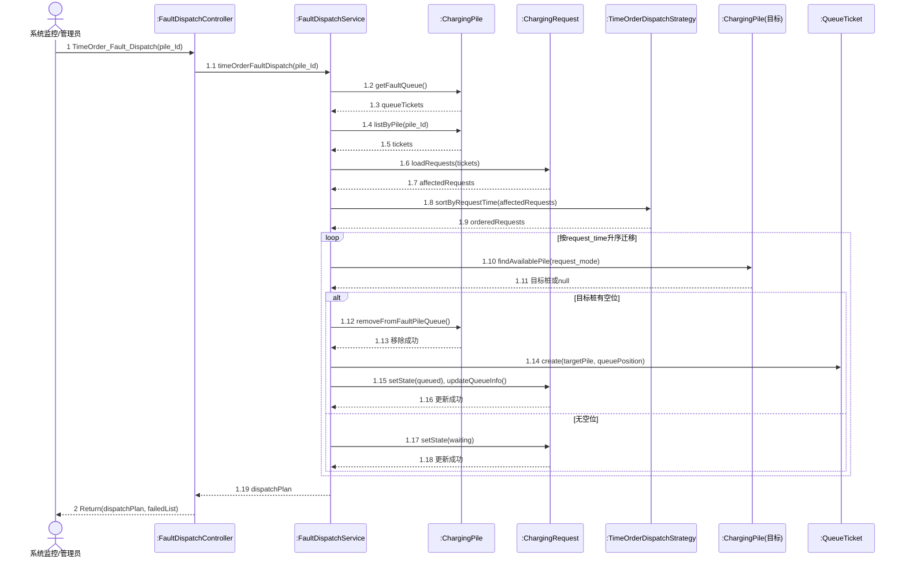
```mermaid
sequenceDiagram
    actor Admin as 系统监控/管理员
    participant Controller as :FaultDispatchController
    participant Service as :FaultDispatchService
    participant FaultPile as :ChargingPile
    participant Req as :ChargingRequest
    participant Strategy as :TimeOrderDispatchStrategy
    participant TargetPile as :ChargingPile(目标)
    participant Ticket as :QueueTicket
    Admin->>Controller: 1 TimeOrder_Fault_Dispatch(pile_Id)
    Controller->>Service: 1.1 timeOrderFaultDispatch(pile_Id)
    Service->>FaultPile: 1.2 getFaultQueue()
    FaultPile-->>Service: 1.3 queueTickets
    Service->>FaultPile: 1.4 listByPile(pile_Id)
    FaultPile-->>Service: 1.5 tickets
    Service->>Req: 1.6 loadRequests(tickets)
    Req-->>Service: 1.7 affectedRequests
    Service->>Strategy: 1.8 sortByRequestTime(affectedRequests)
    Strategy-->>Service: 1.9 orderedRequests
    loop 按request_time升序迁移
        Service->>TargetPile: 1.10 findAvailablePile(request_mode)
        TargetPile-->>Service: 1.11 目标桩或null
        alt 目标桩有空位
            Service->>FaultPile: 1.12 removeFromFaultPileQueue()
            FaultPile-->>Service: 1.13 移除成功
            Service->>Ticket: 1.14 create(targetPile, queuePosition)
            Service->>Req: 1.15 setState(queued), updateQueueInfo()
            Req-->>Service: 1.16 更新成功
        else 无空位
            Service->>Req: 1.17 setState(waiting)
            Req-->>Service: 1.18 更新成功
        end
    end
    Service-->>Controller: 1.19 dispatchPlan
    Controller-->>Admin: 2 Return(dispatchPlan, failedList)
```

#### 对象设计：故障恢复调度

操作契约

| 操作 | Fault_Recovery_Dispatch(pile_Id) |
| --- | --- |
| 前置条件 | 管理员确认维修完成，或设备自检上报恢复；
pile_Id 对应 ChargingPile 存在；
该桩状态为 FAULT 或 REPAIRING；
物理设备通信链路正常；
充电桩已绑定有效 TariffPolicy；
6. 该桩不存在 status="charging" 的活跃 ChargingSession。 |
| 后置条件 | 调用设备适配器执行自检；
自检通过后清除故障标记，将 ChargingPile.working_state 修改为 IDLE 或 RUNNING；
关闭 FaultRecord，记录 recovery_time；
重新注册 PileMonitorScheduler；
若恢复桩队列存在空位，则调用 NormalDispatchStrategy 从 WaitingArea 中调入同模式车辆；
持久化充电桩状态、故障记录和新建 QueueTicket；
7. 自检失败时保持故障状态并返回失败原因。 |

问题1：第一个接收该消息的软件对象是什么？

第一个接收消息的软件对象为 FaultDispatchController。故障恢复仍属于“充电桩故障调度”用例，控制器负责接收恢复请求、确认维修权限，并调用 FaultRecoveryService 完成恢复流程。

问题2：根据操作契约，哪个对象负责创建对象实例？

FaultRecoveryService 通常不创建新的核心业务实体，只更新 ChargingPile 和 FaultRecord。当恢复后的充电桩出现空位并触发补位时，NormalDispatchStrategy 结合 DispatchService 创建新的 QueueTicket 实例。若系统需要审计，也可以由 FaultRecoveryService 创建 RecoveryLog。

问题3：哪些对象之间需要建立或消除关联关系？

恢复流程会关闭 FaultRecord 与 ChargingPile 的故障关联状态，但保留历史记录；重新建立 ChargingPile 与 PileMonitorScheduler 的监控注册关系；若触发补位，则建立 QueueTicket 与恢复桩的队列关联，并消除对应车辆在 WaitingArea 中的等待关联。已在故障期间迁移到其他桩的车辆不强制迁回，避免破坏已稳定的队列秩序。

问题4：哪个对象的属性需要修改或者初始化？

ChargingPile 的 fault_flag 修改为 false，working_state 修改为 IDLE 或 RUNNING，update_time 更新为当前时间；FaultRecord 的 status 修改为 recovered，recovery_time 初始化为当前时间；新建 QueueTicket 初始化 queue_Num、queue_Position、create_time；被调入车辆的 ChargingRequest.car_state 修改为 queued。

问题5：恢复失败时如何处理？

若设备自检失败、计费规则缺失或存在未结束的 ChargingSession，则保持 ChargingPile 的故障状态，不关闭 FaultRecord，也不触发正常调度。FaultDispatchController 将失败原因封装为 JSON 返回给管理员端。

交互图：

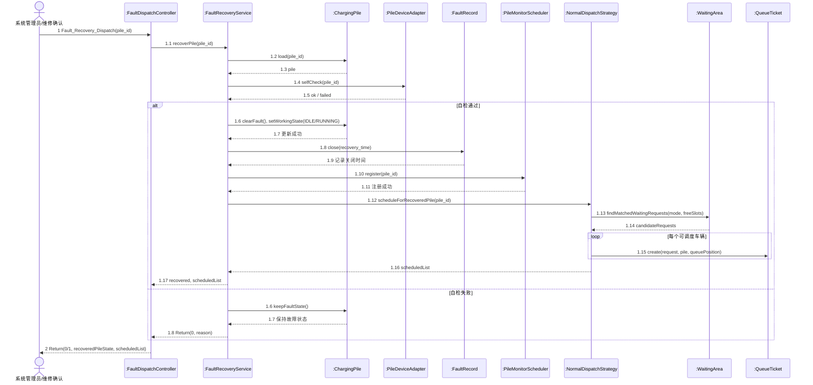
```mermaid
sequenceDiagram
    actor Admin as 系统管理员/维修确认
    participant Controller as :FaultDispatchController
    participant Service as :FaultRecoveryService
    participant Pile as :ChargingPile
    participant Adapter as :PileDeviceAdapter
    participant Record as :FaultRecord
    participant Scheduler as :PileMonitorScheduler
    participant Strategy as :NormalDispatchStrategy
    participant Waiting as :WaitingArea
    participant Ticket as :QueueTicket
    Admin->>Controller: 1 Fault_Recovery_Dispatch(pile_id)
    Controller->>Service: 1.1 recoverPile(pile_id)
    Service->>Pile: 1.2 load(pile_id)
    Pile-->>Service: 1.3 pile
    Service->>Adapter: 1.4 selfCheck(pile_id)
    Adapter-->>Service: 1.5 ok / failed
    alt 自检通过
        Service->>Pile: 1.6 clearFault(), setWorkingState(IDLE/RUNNING)
        Pile-->>Service: 1.7 更新成功
        Service->>Record: 1.8 close(recovery_time)
        Record-->>Service: 1.9 记录关闭时间
        Service->>Scheduler: 1.10 register(pile_id)
        Scheduler-->>Service: 1.11 注册成功
        Service->>Strategy: 1.12 scheduleForRecoveredPile(pile_id)
        Strategy->>Waiting: 1.13 findMatchedWaitingRequests(mode, freeSlots)
        Waiting-->>Strategy: 1.14 candidateRequests
        loop 每个可调度车辆
            Strategy->>Ticket: 1.15 create(request, pile, queuePosition)
        end
        Strategy-->>Service: 1.16 scheduledList
        Service-->>Controller: 1.17 recovered, scheduledList
    else 自检失败
        Service->>Pile: 1.6 keepFaultState()
        Pile-->>Service: 1.7 保持故障状态
        Service-->>Controller: 1.8 Return(0, reason)
    end
    Controller-->>Admin: 2 Return(0/1, recoveredPileState, scheduledList)
```

### 正常调度策略

#### 已知条件

| 指令 | 返回 |  |
| --- | --- | --- |
| 1、单次调度总充电时长最短 | Single_MinTime_Dispatch() | Return(dispatchedCount, dispatchPlan) |
| 2、批量调度总充电时长最短 | Batch_MinTime_Dispatch() | Return(dispatchedCount, dispatchPlan) |

#### 对象设计：单次调度总充电时长最短

操作契约

| 操作 | Single_MinTime_Dispatch() |
| --- | --- |
| 前置条件 | 充电区出现多个车辆空位；
等候区存在等待调度的车辆；
每辆待调度车辆仍处于 waiting 状态；
本策略按充电模式分配对应充电桩，即快充车辆只能进入快充桩队列，慢充车辆只能进入慢充桩队列；
5. 不考虑用户修改请求和充电桩故障。 |
| 后置条件 | 为每辆被调度进入充电区的车辆创建新的 QueueTicket 对象；
建立 QueueTicket 与目标 ChargingPile 的队列关联；
消除该车辆在 WaitingArea 中的等待关联；
修改对应 ChargingRequest 的属性：car_state = queued，新增或更新 queue_Num 与 queue_Position；
5. 返回本次调度车辆数量和调度方案。 |

问题1：第一个接收该消息的软件对象是什么？

该消息属于调度系统内部触发的扩展调度指令，不由普通用户直接触发。因此第一个接收消息的软件对象使用控制器层对象 DispatchController，由它接收空位事件或定时任务触发的 Single_MinTime_Dispatch()。

问题2：根据操作契约，哪个对象负责创建 QueueTicket 实例？

本操作中需要为进入充电区的车辆创建新的排队号 QueueTicket。从职责看，DispatchService 掌握最优调度方案中的车辆、目标充电桩编号和队列位置，因此由 DispatchService 调用 QueueTicket 的创建操作最合适。QueueTicket 创建后再加入目标 ChargingPile 的等待队列。

问题3：哪些对象之间需要建立或消除关联关系？

需要建立 QueueTicket 与目标 ChargingPile 的队列关联，即 ChargingPile 管理该排队号；同时车辆被调度进入充电区后，应从 WaitingArea 中移除，表示原有等待关联被消除。

问题4：哪个对象的属性需要修改或初始化？

新建的 QueueTicket 需要初始化 queue_Num 和 queue_Position。对应 ChargingRequest 的 car_state 需要由 waiting 修改为 queued，同时写入 queue_Num 和 queue_Position。

交互图

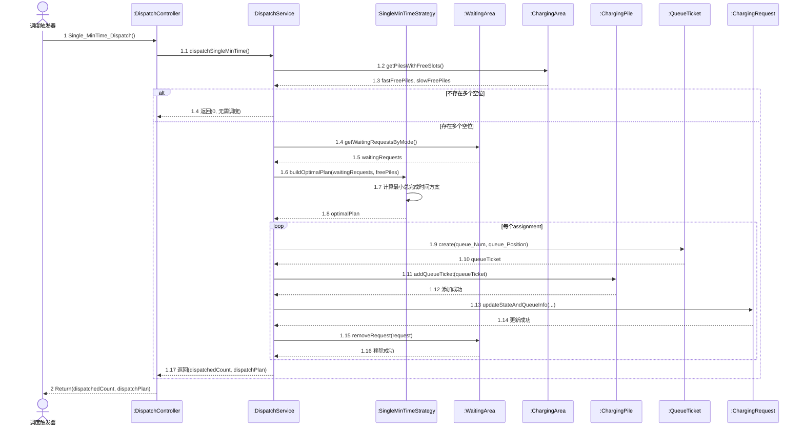
```mermaid
sequenceDiagram
    actor Trigger as 调度触发器
    participant Controller as :DispatchController
    participant Service as :DispatchService
    participant Strategy as :SingleMinTimeStrategy
    participant Waiting as :WaitingArea
    participant Area as :ChargingArea
    participant Pile as :ChargingPile
    participant Ticket as :QueueTicket
    participant Req as :ChargingRequest
    Trigger->>Controller: 1 Single_MinTime_Dispatch()
    Controller->>Service: 1.1 dispatchSingleMinTime()
    Service->>Area: 1.2 getPilesWithFreeSlots()
    Area-->>Service: 1.3 fastFreePiles, slowFreePiles
    alt 不存在多个空位
        Service-->>Controller: 1.4 返回(0, 无需调度)
    else 存在多个空位
        Service->>Waiting: 1.4 getWaitingRequestsByMode()
        Waiting-->>Service: 1.5 waitingRequests
        Service->>Strategy: 1.6 buildOptimalPlan(waitingRequests, freePiles)
        Strategy->>Strategy: 1.7 计算最小总完成时间方案
        Strategy-->>Service: 1.8 optimalPlan
        loop 每个assignment
            Service->>Ticket: 1.9 create(queue_Num, queue_Position)
            Ticket-->>Service: 1.10 queueTicket
            Service->>Pile: 1.11 addQueueTicket(queueTicket)
            Pile-->>Service: 1.12 添加成功
            Service->>Req: 1.13 updateStateAndQueueInfo(...)
            Req-->>Service: 1.14 更新成功
            Service->>Waiting: 1.15 removeRequest(request)
            Waiting-->>Service: 1.16 移除成功
        end
        Service-->>Controller: 1.17 返回(dispatchedCount, dispatchPlan)
    end
    Controller-->>Trigger: 2 Return(dispatchedCount, dispatchPlan)
```

#### 对象设计：批量调度总充电时长最短

操作契约

| 操作 | Batch_MinTime_Dispatch() |
| --- | --- |
| 前置条件 | 到达充电站的车辆数量等于全部车位数量，即充电区容量与等候区容量之和；
当前批次尚未开始调度；
本策略不区分快充和慢充模式；
车辆到达先后顺序不参与调度；
所有车辆均可分配到任意类型充电桩；
6. 不考虑用户修改请求和充电桩故障。 |
| 后置条件 | 为批次中每辆进入充电区队列的车辆创建新的 QueueTicket 对象；
建立每个 QueueTicket 与目标 ChargingPile 的队列关联；
消除车辆与 WaitingArea 的等待关联；
修改对应 ChargingRequest 的属性：car_state = queued，新增或更新 queue_Num 与 queue_Position；
5. 返回批量调度车辆数量和调度方案。 |

问题1：第一个接收该消息的软件对象是什么？

批量调度由“车辆数达到总车位数”这一内部条件触发，因此由DispatchController作为第一个接收该系统事件的软件对象。

问题2：根据操作契约，哪个对象负责创建QueueTicket实例？

批量调度中，BatchDispatchService掌握当前批次车辆、所有可用充电桩以及最优调度方案，因此由BatchDispatchService负责调用QueueTicket的创建操作，为每辆被分配到充电区队列的车辆创建新的排队号。

问题3：哪些对象之间需要建立或消除关联关系？

每个新建的QueueTicket都需要加入对应ChargingPile的排队队列，从而建立QueueTicket与ChargingPile的关联。车辆完成批量调度后，需要从WaitingArea中移除，从而消除等候区关联。

问题4：哪个对象的属性需要修改或初始化？

QueueTicket初始化queue_Num和queue_Position。对应ChargingRequest的car_state从waiting修改为queued，并写入queue_Num与queue_Position。

###### 交互图

```mermaid
sequenceDiagram
    actor Trigger as 批量调度触发器
    participant Controller as :DispatchController
    participant Service as :BatchDispatchService
    participant Strategy as :BatchMinTimeStrategy
    participant Config as :StationConfig
    participant Waiting as :WaitingArea
    participant Area as :ChargingArea
    participant Pile as :ChargingPile
    participant Ticket as :QueueTicket
    participant Req as :ChargingRequest
    Trigger->>Controller: 1 Batch_MinTime_Dispatch()
    Controller->>Service: 1.1 dispatchBatchMinTime()
    Service->>Config: 1.2 getTotalStationCapacity()
    Config-->>Service: 1.3 totalCapacity
    Service->>Waiting: 1.4 countWaitingRequests()
    Waiting-->>Service: 1.5 currentVehicleCount
    alt currentVehicleCount < totalCapacity
        Service-->>Controller: 1.6 返回(0, 未达到批量调度条件)
    else currentVehicleCount == totalCapacity
        Service->>Waiting: 1.6 getAllWaitingRequests()
        Waiting-->>Service: 1.7 batchRequests
        Service->>Area: 1.8 getAllAvailablePiles()
        Area-->>Service: 1.9 allPiles
        Service->>Strategy: 1.10 buildOptimalPlan(batchRequests, allPiles)
        Strategy->>Strategy: 1.11 计算最小总完成时间方案
        Strategy-->>Service: 1.12 optimalPlan
        loop 每个assignment
            Service->>Ticket: 1.13 create(queue_Num, queue_Position)
            Ticket-->>Service: 1.14 queueTicket
            Service->>Pile: 1.15 addQueueTicket(queueTicket)
            Pile-->>Service: 1.16 添加成功
            Service->>Req: 1.17 updateStateAndQueueInfo(...)
            Req-->>Service: 1.18 更新成功
            Service->>Waiting: 1.19 removeRequest(request)
            Waiting-->>Service: 1.20 移除成功
        end
        Service-->>Controller: 1.21 返回(dispatchedCount, batchDispatchPlan)
    end
    Controller-->>Trigger: 2 Return(dispatchedCount, batchDispatchPlan)
```

## 系统静态结构设计

### 用例:UC_注册

```plantuml
@startuml
class RegisterController {
  + createNewAccount(carId, userName, carCapacity): int
  + set_pwd(pwd): int
}
class "车辆DAO" as VehicleDAO {
  + insert(car): int
  + update(car): int
  + findById(carId): 车辆
}
class "客户DAO" as CustomerDAO {
  + insert(customer): int
  + update(customer): int
  + findByUserName(name): 客户
}
class 客户 {
  - 客户ID: String
  - 用户名: String
  - 密码: String
  + setPassword(pwd): void
  + setCar(car): void
}
class 车辆 {
  - 车牌号: String
  - 电池容量: double
  - 剩余电量: double
}
RegisterController --> VehicleDAO : 使用
RegisterController --> CustomerDAO : 使用
RegisterController --> 车辆 : 创建
客户 "1" -- "0..*" 车辆 : 拥有
@enduml
```

| 类名 | 类类型 | 核心属性 | 核心方法 |
| --- | --- | --- | --- |
| RegisterController | 控制器类 | 无 | createNewAccount(carId, userName, carCapacity)创建账号并关联车辆信息
set_pwd(pwd) 设置用户密码 |
| 客户 | 实体类 | customerId
userName
password | new(userName)构造函数，初始化用户名
setPassword(pwd)设置密码
setCar(car)关联车辆 |
| 车辆 | 实体类 | carId
batteryCapacity
remainingCapacity | new(carId: , capacity)构造函数，初始化车牌号和电池容量 |
| 车辆DAO | 持久化类（DAO） | 无 | insert(car)插入车辆记录
update(car)更新车辆记录
findById(carId)根据车牌号查询车辆 |
| 客户DAO | 持久化类（DAO） | 无 | insert(customer)插入客户记录
update(customer) 更新客户记录
findByUserName(name) 根据用户名查询客户 |

### 用例:UC_充电申请

```plantuml
@startuml
skinparam classAttributeIconSize 0

class ChargingApplicationController {
  + E_chargingRequest(carId, amount, mode): Object[]
  + Modify_Amount(carId, amount): int
  + Modify_Mode(carId, mode): int
  + Query_Car_State(carId): Object[]
  + Start_Charging(carId, pileId): int
  + Query_Charging_State(carId): 充电详情单
  + End_Charging(carId, pileId): int
}

class 车辆 {
  - 车牌号: String
  - 电池容量: double
  - 剩余电量: double
  + findById(carId): 车辆
}

class 等待区 {
  - 容量: int
  - 等待列表: List<充电请求>
  + add(req): int[]
  + remove(req): void
  + getFirstByMode(mode): 充电请求
}

interface 调度策略 {
  + schedule(): void
}

class 计费服务 {
  + generateChargingDetail(req, amount, start, end): 充电详情单
}

class 充电详情单DAO {
  + insert(detail): int
  + findById(detailId): 充电详情单
  + findByCarIdAndDate(carId, date): List
}

class 充电详情单 {
  - 订单ID: String
  - 充电电量: double
  - 充电费: double
  - 服务费: double
  - 总费用: double
  + save(): int
}

class 电价规则 {
  - 峰时电价: double
  - 平时电价: double
  - 谷时电价: double
  + getPriceByTime(time): double
}

class 时间段 {
  - 开始时间: Date
  - 结束时间: Date
  + contains(time): boolean
}

abstract class 充电桩 {
  - 桩编号: String
  - 功率: double
  - 是否工作: boolean
  + assignCharging(req): int
  + stopCharging(req): double[]
  + addToQueue(req): int
}

class 快充电桩
class 慢充电桩

class 队列 {
  - 最大长度: int
  - 请求列表: List<充电请求>
  + add(req): int
  + remove(req): int
}

class 充电请求 {
  - 请求ID: String
  - 请求模式: String
  - 请求电量: double
  - 状态: String
  - 排队号码: String
}

ChargingApplicationController ..> 车辆
ChargingApplicationController ..> 等待区
ChargingApplicationController ..> 计费服务
ChargingApplicationController ..> 充电详情单DAO
ChargingApplicationController ..> 调度策略
等待区 ..> 充电桩
计费服务 ..> 电价规则
计费服务 ..> 充电详情单 : 生成
电价规则 *-- 时间段 : 包含
充电桩 o-- 队列 : 聚合
快充电桩 --|> 充电桩
慢充电桩 --|> 充电桩
队列 "1" *-- "0..*" 充电请求 : 包含
充电请求 --> 车辆
充电详情单 --> 充电桩
充电详情单 --> 充电请求
@enduml
```

| 类名 | 类类型 | 核心属性 | 核心方法 |
| --- | --- | --- | --- |
| ChargingApplicationController | 控制器类 | 无 | E_chargingRequest(carId, amount, mode) 提交充电请求，生成排队号码
Modify_Amount(carId, amount)修改充电量，排队号不变
Modify_Mode(carId, mode)修改充电模式，重新生成排队号码
Query_Car_State(carId) 查询本车排队信息
Start_Charging(carId, pileId)开始充电
Query_Charging_State(carId)查询充电状态（详单）
End_Charging(carId, pileId)  结束充电，生成详单并调度 |
| 车辆 | 实体类 | carId
batteryCapacity
remainingCapacity | findById(carId)根据车牌号查询车辆对象 |
| 充电请求 | 实体类 | requestId
requestMode
requestAmount
status
queueNumber
requestTime
waitStartTime | new(car, amount, mode)构造函数，创建请求对象
setRequestAmount(amount)修改请求电量
setRequestMode(mode) 修改充电模式
setStatus(status) 修改请求状态
regenerateQueueNumber() 重新生成排队号码
findByCarId(carId)根据车牌号查询请求 |
| 等候区 | 实体类 | capacity
waitingList | add(req) 加入等候区，返回排队位置等
remove(req) 从等候区移除请求
getFirstByMode(mode) 获取指定模式的第一辆车
getPosition(req) 获取请求的排队位置与前车数量 |
| 充电桩（抽象） | 抽象类 | pileId
pileType
power
isWorking
queue
totalChargeNum
totalChargeTime
totalCapacity | assignCharging(req) 分配充电并开始充电
stopCharging(req)停止充电，返回实际数据
addToQueue(req) 将请求加入排队队列
removeFromQueue(req)从队列移除请求 |
| 快充电桩 | 具体子类 | 继承父类 | new(pileId)构造函数，初始化快充电桩
其余继承父类 |
| 慢充电桩 | 具体子类 | 继承父类 | new(pileId)构造函数，初始化慢充电桩
其余继承父类 |
| 队列 | 实体类 | maxLength
requestList | add(req)添加请求到队列
remove(req)从队列移除请求 |
| 计费服务 | 服务类 | 无 | generateChargingDetail(req, amount, start, end) 生成充电详单 |
| 电价规则 | 实体类 | peakPeriods
flatPeriods
valleyPeriods
peakPrice
flatPrice
valleyPrice | getPriceByTime(time)根据时间返回对应电价 |
| 时间段 | 值对象 | startTime
endTime | new(start, end) 构造函数，初始化时段
contains(time) 判断给定时间是否在该时段内 |
| 充电详单 | 实体类 | detailId
generateTime
pileId
chargeAmount
chargeDuration
startTime
endTime
chargeFee
serviceFee
totalFee
carId
requestId | new(...)  构造函数，初始化详单各项字段
save()保存详单（内存/持久化） |
| 充电详单DAO | 持久化类（DAO） | 无 | insert(detail)插入详单记录
findById(detailId)根据详单ID查询
findByCarIdAndDate(carId, date)按车辆和日期查询详单列表
findByCarIdAndStatus(carId, status) 按车辆和状态查询详单 |
| 调度策略（接口） | 接口 | 无 | schedule()执行调度算法，从等候区叫号并加入充电桩队列 |

### 用例:UC_查看账单

```plantuml
@startuml
interface IBillService {
  + queryBill(carId, date): BillDTO
}
class BillServiceImpl {
  + queryBill(carId, date): BillDTO
  + assembleBillDTO(bill): BillDTO
}
class Bill {
  - bill_id: String
  - car_id: String
  - date: Date
  - charge_amount: double
  - total_fee: double
}
class ChargingSession {
  - session_id: String
  - start_time: DateTime
  - end_time: DateTime
  - charge_amount: double
  - pile_id: FK
}
class ChargingPile {
  - pile_id: String
  - working_state: String
}
BillServiceImpl ..|> IBillService
BillServiceImpl ..> Bill : 查询
BillServiceImpl ..> ChargingSession : 查询
BillServiceImpl ..> ChargingPile
Bill "1" --> "1" ChargingSession : ForeignKey
ChargingSession "0..*" --> "1" ChargingPile : ForeignKey
@enduml
```

类属性与方法说明：

| 类名 | 类型 | 主要属性 | 主要方法 | 职责说明 |
| --- | --- | --- | --- | --- |
| IBillService | 接口 | — | queryBill | 定义 Request_Bill 业务契约 |
| BillServiceImpl | 实现类 | — | queryBill、assembleBillDTO | 按 carId、date 查询账单与会话，组装 Return 字段 |
| Bill | Model | bill_id、car_id、date、total_fee 等 | — | 账单汇总实体 |
| ChargingSession | Model | session_id、start_time、end_time、charge_amount | getChargeDuration() | 提供充电时长、电量、起止时间 |
| ChargingPile | Model | pile_id、working_state | getPileId() | 提供 ChargePileNum |

### 用例:UC_查看账单（子）

```plantuml
@startuml
interface IDetailedListService {
  + queryDetailedList(bill_id): DetailedListDTO
}
class DetailedListServiceImpl {
  + queryDetailedList(bill_id): DetailedListDTO
  + assembleDetailDTO(detail): DetailedListDTO
}
class Bill {
  - bill_id: String
  - car_id: String
  - date: Date
}
class DetailedList {
  - detail_id: String
  - bill_id: FK
  - charge_fee: double
  - service_fee: double
  - subtotal_fee: double
}
class ChargingSession {
  - session_id: String
  - charge_amount: double
  - charge_duration: double
}
class TariffPolicy {
  - policy_id: String
  - service_price: double
}
DetailedListServiceImpl ..|> IDetailedListService
DetailedListServiceImpl ..> DetailedList : 查询
DetailedListServiceImpl ..> Bill : 查询
DetailedListServiceImpl ..> ChargingSession
Bill "1" --> "1" DetailedList : ForeignKey
Bill "1" --> "1" ChargingSession : ForeignKey
DetailedList ..> TariffPolicy : 计费依据
@enduml
```

类属性与方法说明：

| 类名 | 类型 | 主要属性 | 主要方法 | 职责说明 |
| --- | --- | --- | --- | --- |
| IDetailedListService | 接口 | — | queryDetailedList | 定义 Request_DetailedList 业务契约 |
| DetailedListServiceImpl | 实现类 | — | queryDetailedList、assembleDetailDTO | 按 Bill_Id 查询详单并组装费用明细 |
| Bill | Model | bill_id、car_id、date | — | 详单查询索引对象 |
| DetailedList | Model | charge_fee、service_fee、subtotal_fee | getFeeBreakdown() | 保存电费、服务费、小计 |
| ChargingSession | Model | charge_amount、charge_duration、start_time、end_time | getChargeDuration() | 提供充电量、时长、起止时间 |
| TariffPolicy | Model | policy_id、service_price | getPriceByTime() | 详单生成时的计费依据 |

### 用例:UC_运行充电桩

```plantuml
@startuml
class AdminClient <<boundary>> {
  + powerOff(pileId): PileControlResponseDTO
  + powerOn(pileId): PileControlResponseDTO
  + setParameters(pileId, params): PileControlResponseDTO
  + startChargingPile(pileId): PileControlResponseDTO
}
class ChargingPileControlController <<control>> {
  + powerOff(pileId): PileControlResponseDTO
  + powerOn(pileId): PileControlResponseDTO
  + setParameters(pileId, params): PileControlResponseDTO
  + startChargingPile(pileId): PileControlResponseDTO
}
class ChargingPileControlService <<control>> {
  + powerOff(pileId, adminId): PileControlResponseDTO
  + powerOn(pileId, adminId): PileControlResponseDTO
  + setParameters(pileId, params, adminId): PileControlResponseDTO
  + startChargingPile(pileId, adminId): PileControlResponseDTO
}
class PileControlResponseDTO <<DTO>> {
  + success: boolean
  + message: String
  + pileId: String
  + newStatus: String
}
class ChargingSessionRepository <<repository>>
class ChargingPileRepository <<repository>>
class OperationLogRepository <<repository>>
class ChargingSession <<entity>>
class ChargingPile <<entity>>
class OperationLog <<entity>>
class Admin <<entity>>

AdminClient --> ChargingPileControlController : 提交控制请求
ChargingPileControlController --> ChargingPileControlService : 调用控制服务
ChargingPileControlService --> PileControlResponseDTO : 组装返回数据
ChargingPileControlService --> ChargingSessionRepository
ChargingPileControlService --> ChargingPileRepository
ChargingPileControlService --> OperationLogRepository
ChargingSessionRepository ..> ChargingSession : 持久化
ChargingPileRepository ..> ChargingPile : 持久化
OperationLogRepository ..> OperationLog : 持久化
ChargingSession "0..*" --> "1" ChargingPile : 使用
OperationLog "0..*" --> "1" Admin : 操作人
@enduml
```

类属性与方法说明

| 类名 | 类类型 | 核心属性 | 核心方法 |
| --- | --- | --- | --- |
| AdminClient | 边界层 | 无 | powerOff (pileId: String): 提交关闭充电桩请求
powerOn (pileId: String): 提交启动充电桩请求
setParameters (pileId: String, params: Map): 提交设置参数请求
startChargingPile (pileId: String): 提交运行充电桩请求 |
| ChargingPileControlController | 控制层 | 无 | powerOff (pileId: String): 接收关闭请求，参数校验后调用服务
powerOn (pileId: String): 接收启动请求，参数校验后调用服务
setParameters (pileId: String, params: Map): 接收设置参数请求，参数校验后调用服务
startChargingPile (pileId: String): 接收运行请求，参数校验后调用服务 |
| ChargingPileControlService | 服务层 | 无 | powerOff (pileId: String, adminId: String): 执行关闭充电桩业务逻辑
powerOn (pileId: String, adminId: String): 执行启动充电桩业务逻辑
setParameters (pileId: String, params: Map, adminId: String): 执行设置参数业务逻辑
startChargingPile (pileId: String, adminId: String): 执行运行充电桩业务逻辑
assembleResponseDTO (success: boolean, message: String): 组装响应数据 |
| PileControlResponseDTO | 数据传输对象层 | success: booleanmessage: StringpileId: StringnewStatus: StringoperateTime: DateTime | 无（仅用于数据传输） |
| ChargingPileRepository | 仓储层 | 无 | findByPileId (pileId: String): 根据 ID 查询充电桩
updateStatus (pileId: String, status: String): 更新充电桩状态
updateParameters (pileId: String, params: Map): 更新充电桩参数 |
| ChargingSessionRepository | 仓储层 | 无 | findActiveByPileId (pileId: String): 查询指定充电桩的活跃会话
updateStatus (sessionId: String, status: String): 更新会话状态
updateEndTime (sessionId: String, endTime: DateTime): 更新会话结束时间 |
| OperationLogRepository | 仓储层 | 无 | save (log: OperationLog): 保存操作日志 |
| Admin | 实体层 | adminId: Stringusername: Stringpassword: Stringrole: String | getAdminId (): 获取管理员
IDgetRole (): 获取管理员角色 |
| ChargingPile | 实体层 | pileId: StringpileType: Stringstatus: StringtotalChargeNum: IntegertotalChargeTime: IntegertotalCapacity: DoublecreateTime: DateTimeupdateTime: DateTime | getPileId (): 获取充电桩
IDgetStatus (): 获取状态setStatus (status: String): 设置状态 |
| ChargingSession | 实体层 | sessionId: StringcarId: StringpileId: StringstartTime: DateTimeendTime: DateTimechargeCapacity: Doublestatus: String | getSessionId (): 获取会话
IDgetStatus (): 获取状态
setStatus (status: String): 设置状态
setEndTime (endTime: DateTime): 设置结束时间 |
| OperationLog | 实体层 | logId: StringadminId: StringpileId: Stringoperation: StringoperateTime: DateTime | getLogId (): 获取日志 ID |

### 用例:UC_查看充电桩状态

用例级分层类图：

```plantuml
@startuml
class Admin <<entity>>
class AdminClient <<boundary>> {
  + queryPileState(pileId): PileStateDTO
  + queryAllPilesState(): List<PileStateDTO>
}
class ChargingPileMonitorController <<control>>
class ChargingPileMonitorService <<control>> {
  + queryPileState(pileId): PileStateDTO
  + queryAllPilesState(): List<PileStateDTO>
}
class PileStateDTO <<DTO>>
class ChargingSessionRepository <<repository>>
class ChargingPileRepository <<repository>>
class ChargingSession <<entity>>
class ChargingPile <<entity>>

Admin --> AdminClient : 操作
AdminClient --> ChargingPileMonitorController : 提交状态查询请求
ChargingPileMonitorController --> ChargingPileMonitorService : 调用监控服务
ChargingPileMonitorService --> PileStateDTO : 组装返回数据
ChargingPileMonitorService --> ChargingSessionRepository : 统计充电数据
ChargingPileMonitorService --> ChargingPileRepository : 查询充电桩
ChargingSessionRepository ..> ChargingSession : 持久化
ChargingPileRepository ..> ChargingPile : 持久化
ChargingSession "0..*" --> "1" ChargingPile : 属于
@enduml
```

类属性与方法说明

| 类名 | 类类型 | 核心属性 | 核心方法 |
| --- | --- | --- | --- |
| AdminClient | 边界层 | 无 | queryPileState (pileId: String): 提交单个充电桩状态查询请求
queryAllPilesState (): 提交所有充电桩状态查询请求 |
| ChargingPileMonitorController | 控制层 | 无 | queryPileState (pileId: String): 接收单个查询请求，参数校验后调用服务
queryAllPilesState (): 接收批量查询请求，参数校验后调用服务 |
| ChargingPileMonitorService | 服务层 | 无 | queryPileState (pileId: String): 执行单个充电桩状态查询业务逻辑
queryAllPilesState (): 执行所有充电桩状态查询业务逻辑
assemblePileStateDTO (pile: ChargingPile): 组装单个充电桩状态
DTOcalculateTotalChargeNum (pileId: String): 计算累计充电次数
calculateTotalChargeTime (pileId: String): 计算累计充电时长
calculateTotalCapacity (pileId: String): 计算累计充电容量 |
| PileStateDTO | 数据传输对象层 | pileId: StringpileType: StringworkingState: StringtotalChargeNum: IntegertotalChargeTime: IntegertotalCapacity: DoubleupdateTime: DateTime | 无（仅用于数据传输） |
| ChargingPileRepository | 仓储层 | 无 | findByPileId (pileId: String): 根据 ID 查询充电桩
findAll (): 查询所有充电桩 |
| ChargingSessionRepository | 仓储层 | 无 | countByPileIdAndStatusIn (pileId: String, statuses: List): 统计指定状态的会话数量
sumChargeTimeByPileIdAndStatusIn (pileId: String, statuses: List): 统计指定状态的会话总时长
sumChargeCapacityByPileIdAndStatusIn (pileId: String, statuses: List): 统计指定状态的会话总容量 |
| Admin | 实体层 | adminId: Stringusername: Stringrole: String | getAdminId (): 获取管理员
IDgetRole (): 获取管理员角色 |
| ChargingPile | 实体层 | pileId: StringpileType: Stringstatus: StringtotalChargeNum: IntegertotalChargeTime: IntegertotalCapacity: DoublecreateTime: DateTimeupdateTime: DateTime | getPileId (): 获取
IDgetPileType (): 获取类型
getStatus (): 获取状态
getUpdateTime (): 获取最后更新时间 |
| ChargingSession | 实体层 | sessionId: StringpileId: StringstartTime: DateTimeendTime: DateTimechargeCapacity: Doublestatus: String | getPileId (): 获取关联充电桩
IDgetStartTime (): 获取开始时
间getEndTime (): 获取结束时间
getChargeCapacity (): 获取充电
量getStatus (): 获取状态 |

### 用例:UC_查看队列状态（子）

用例级分层类图：

```plantuml
@startuml
class Admin <<entity>>
class AdminClient <<boundary>> {
  + queryQueueState(pileId): List<QueueVehicleDTO>
}
class ChargingQueueMonitorController <<control>>
class ChargingQueueMonitorService <<control>> {
  + queryQueueState(pileId): List<QueueVehicleDTO>
}
class QueueVehicleDTO <<DTO>>
class ChargingRequestRepository <<repository>>
class QueueRepository <<repository>>
class VehicleRepository <<repository>>
class ChargingRequest <<entity>>
class Queue <<entity>>
class Vehicle <<entity>>

Admin --> AdminClient : 操作
AdminClient --> ChargingQueueMonitorController : 提交队列查询请求
ChargingQueueMonitorController --> ChargingQueueMonitorService : 调用队列监控服务
ChargingQueueMonitorService --> QueueVehicleDTO : 组装返回数据
ChargingQueueMonitorService --> QueueRepository : 查询队列
ChargingQueueMonitorService --> ChargingRequestRepository : 查询充电请求
ChargingQueueMonitorService --> VehicleRepository : 查询车辆信息
QueueRepository ..> Queue : 持久化
ChargingRequestRepository ..> ChargingRequest : 持久化
VehicleRepository ..> Vehicle : 持久化
ChargingRequest "0..*" --> "1" Queue : 属于
ChargingRequest "1" --> "1" Vehicle : 关联
@enduml
```

类属性与方法说明

| 类名 | 类类型 | 核心属性 | 核心方法 |
| --- | --- | --- | --- |
| AdminClient | 边界层 | 无 | queryQueueState (pileId: String): 提交指定充电桩的队列查询请求 |
| ChargingQueueMonitorController | 控制层 | 无 | queryQueueState (pileId: String): 接收队列查询请求，参数校验后调用服务 |
| ChargingQueueMonitorService | 服务层 | 无 | queryQueueState (pileId: String): 执行队列状态查询业务逻辑
assembleQueueVehicleDTO (request: ChargingRequest, vehicle: Vehicle): 组装单个车辆信息
DTOcalculateWaitTime (requestTime: DateTime): 计算已等待时长（分钟） |
| QueueVehicleDTO | 数据传输对象层 | carId: StringcarCapacity: DoublerequestAmount: DoublewaitTime: IntegerqueuePosition: Integer | 无（仅用于数据传输） |
| QueueRepository | 仓储层 | 无 | findByPileId (pileId: String): 根据充电桩 ID 查询对应的队列 |
| ChargingRequestRepository | 仓储层 | 无 | findByQueueIdAndStatus (queueId: String, status: String): 查询指定队列中指定状态的所有请求 |
| VehicleRepository | 仓储层 | 无 | findByCarId (carId: String): 根据车辆 ID 查询车辆信息 |
| Admin | 实体层 | adminId: Stringusername: Stringrole: String | getAdminId (): 获取管理员 IDgetRole (): 获取管理员角色 |
| Queue | 实体层 | queueId: StringpileId: StringmaxLength: IntegercurrentLength: IntegercreateTime: DateTime | getQueueId (): 获取队列
IDgetPileId (): 获取关联充电桩
IDgetCurrentLength (): 获取当前队列长度 |
| ChargingRequest | 实体层 | requestId: StringcarId: StringqueueId: StringrequestAmount: DoublerequestMode: StringrequestTime: DateTimestatus: StringqueuePosition: Integer | getCarId (): 获取车辆
IDgetRequestAmount (): 获取请求充电量
getRequestTime (): 获取请求时间
getQueuePosition (): 获取排队位置 |
| Vehicle | 实体层 | carId: StringuserId: Stringcapacity: DoublecreateTime: DateTime | getCarId (): 获取车辆 IDgetCapacity (): 获取电池容量 |

### 系统级的静态结构

```plantuml
@startuml
skinparam classAttributeIconSize 0

class 管理员
class 充电站
class 等候区
interface 调度策略
class 计费服务
class 报表数据
abstract class 充电桩
class 快充电桩
class 慢充电桩
class 充电详单
class 电价规则
class 时间段
class 客户
class 车辆
class 队列
class 充电请求

管理员 --> 充电站 : 管理
充电站 o-- 等候区 : 聚合
充电站 ..> 调度策略 : 依赖
充电站 ..> 计费服务 : 依赖
充电站 ..> 电价规则 : 依赖
充电站 --> 报表数据 : 生成
充电站 o-- 快充电桩 : 聚合
充电站 o-- 慢充电桩 : 聚合
快充电桩 --|> 充电桩 : 继承
慢充电桩 --|> 充电桩 : 继承
计费服务 --> 充电详单 : 生成
计费服务 --> 电价规则 : 使用
电价规则 --> 时间段 : 包含
充电桩 o-- 队列 : 聚合
充电详单 --> 充电桩 : 关联
充电详单 --> 充电请求 : 关联
客户 --> 车辆 : 拥有
车辆 "1" --> "0..*" 充电请求
队列 "1" --> "0..*" 充电请求 : 包含
@enduml
```

## 工作量统计

###### 表4作业工作内容及工作量统计

|  |  | 王俊涛 | 李文睿 | 孙奥翔 | 郭峰 | 张云飞 |
| --- | --- | --- | --- | --- | --- | --- |
| 软件架构 | 软件架构示意图 |  |  |  |  |  |
|  | 分层结构说明 |  |  |  |  |  |
| UC_充电申请 | 提交充电申请E_chargingRequest |  |  |  |  |  |
|  | 修改充电量Modify_Amount |  |  |  |  |  |
|  | 修改充电模式Modify_Mode |  |  |  |  |  |
|  | 查看队列状态Query_Car_State |  |  |  |  |  |
|  | 开始充电Start_Charging |  |  |  |  |  |
|  | 查看充电状态Query_Charging_State |  |  |  |  |  |
|  | 结束充电End_Charging |  |  |  |  |  |
| UC_查看账单 | 查看账单申请Request_Bill |  |  |  |  |  |
| UC_查看详单（子） | 查看详单申请Request_DetailedList |  |  |  |  |  |
| UC_运行充电桩 | 启动充电桩powerOn |  |  |  |  |  |
|  | 设置参数setParameters |  |  |  |  |  |
|  | 运行充电桩Start_ChargingPile |  |  |  |  |  |
|  | 关闭充电桩powerOff |  |  |  |  |  |
| UC_查看充电桩状态 | 查看充电桩状态Query_PileState |  |  |  |  |  |
| UC_查看队列状态（子） | 查看队列状态
Query_QueueState |  |  |  |  |  |
| 充电桩故障调度 | 优先级调度 |  |  |  |  |  |
|  | 时间顺序调度 |  |  |  |  |  |
|  | 故障恢复调度 |  |  |  |  |  |
| 正常调度策略 | 单次调度总充电时长最短 |  |  |  |  |  |
|  | 批量调度总充电时长最短 |  |  |  |  |  |
| 静态结构设计 | UC_注册 |  |  |  |  |  |
|  | UC_充电申请 |  |  |  |  |  |
|  | UC_查看账单 |  |  |  |  |  |
|  | UC_查看详单（子） |  |  |  |  |  |
|  | UC_运行充电桩 |  |  |  |  |  |
|  | UC_查看充电桩状态 |  |  |  |  |  |
|  | UC_查看队列状态（子） |  |  |  |  |  |
|  | 系统级静态结构 |  |  |  |  |  |
