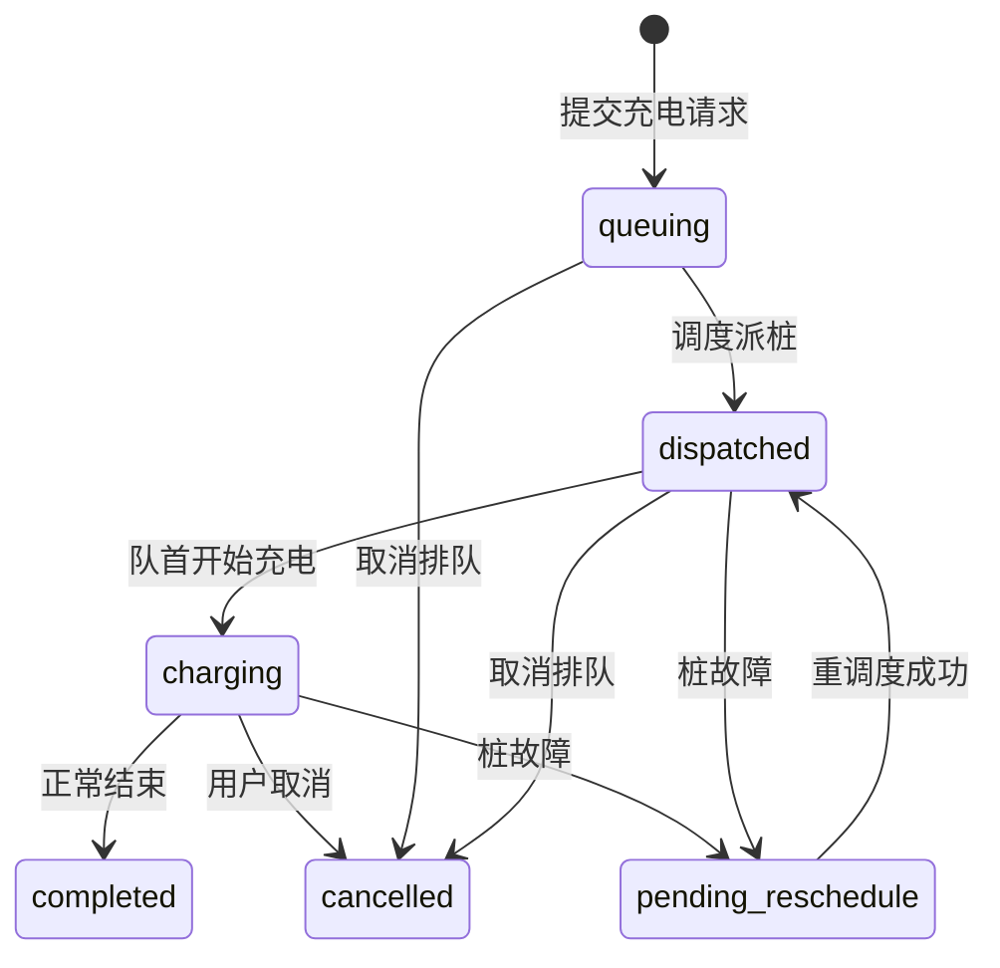

# 后端架构参考手册

> **自动生成文档** — 请勿直接手工编辑正文结构部分。
> 最后生成时间：`2026-06-12 15:53:31 +0800`

## 文档维护规则

### 自动更新（推荐）

修改 `backend/apps/` 下 models、services、views 后，在项目根目录执行：

```bash
python backend/scripts/generate_backend_docs.py
```

CI 校验（确保文档与代码同步）：

```bash
python backend/scripts/generate_backend_docs.py --check
```

### 需手工同步的内容

| 变更类型 | 更新位置 |
|----------|----------|
| 新增/删除 App | 修改 `generate_backend_docs.py` 中 `APP_ORDER` |
| 业务逻辑说明、状态机描述 | 修改 `generate_backend_docs.py` 中 `MANUAL_BUSINESS` |
| API 入参/出参详情 | 更新 `docs/API接口文档.md` |
| 枚举常量语义 | 改 `common/enums.py` 后重新运行生成脚本 |

### 建议触发更新的时机

- 新增 Model 字段或 Service 公开方法
- 修改 View 路由或鉴权装饰器
- 调整调度/计费/故障核心业务逻辑
- 合并 PR 前运行 `--check` 防止文档漂移

---

## 应用总览

| App | 路径 | 职责 |
|-----|------|------|
| common | `apps/common/` | 枚举、鉴权、响应、工具、模拟时钟 |
| accounts | `apps/accounts/` | 注册登录、用户/车辆 |
| station | `apps/station/` | 充电站、配置、充电桩 |
| charging | `apps/charging/` | 充电请求、队列、调度、会话 |
| billing | `apps/billing/` | 分时计费、账单 |
| operations | `apps/operations/` | 故障、报表、验收 |

## 核心状态流转



---

## common

### 业务概述
**职责**：跨模块基础设施。

- `system_now()`：模拟时钟开启时返回虚拟时间，否则真实时间。
- `api_view` / `require_user` / `require_admin`：统一异常捕获与 JWT 鉴权。
- `compute_charged_amount`：已充电量 = min(功率×时长, 请求电量)。

### Enums (`apps/common/enums.py`)

#### `ErrorCode`
- **字段/属性**:
  - `SUCCESS` — 默认/值: `0`
  - `VALIDATION_ERROR` — 默认/值: `1001`
  - `AUTH_ERROR` — 默认/值: `1002`
  - `PERMISSION_ERROR` — 默认/值: `1003`
  - `USER_NOT_FOUND` — 默认/值: `2001`
  - `PASSWORD_ERROR` — 默认/值: `2002`
  - `USER_EXISTS` — 默认/值: `2003`
  - `ACTIVE_REQUEST_EXISTS` — 默认/值: `3001`
  - `REQUEST_NOT_FOUND` — 默认/值: `3002`
  - `INVALID_STATUS` — 默认/值: `3003`
  - `WAITING_AREA_FULL` — 默认/值: `3005`
  - `PILE_NOT_FOUND` — 默认/值: `4001`
  - `PILE_STATUS_ERROR` — 默认/值: `4002`
  - `PILE_NO_SLOT` — 默认/值: `4003`
  - `BILL_NOT_FOUND` — 默认/值: `6001`

#### `ChargeMode`
- **字段/属性**:
  - `FAST` — 默认/值: `'F'`
  - `SLOW` — 默认/值: `'T'`
  - `LABELS` — 默认/值: `{FAST: '快充', SLOW: '慢充'}`

#### `RequestStatus`
- **字段/属性**:
  - `QUEUING` — 默认/值: `'queuing'`
  - `DISPATCHED` — 默认/值: `'dispatched'`
  - `CHARGING` — 默认/值: `'charging'`
  - `PENDING_RESCHEDULE` — 默认/值: `'pending_reschedule'`
  - `COMPLETED` — 默认/值: `'completed'`
  - `CANCELLED` — 默认/值: `'cancelled'`
  - `ACTIVE` — 默认/值: `{QUEUING, DISPATCHED, CHARGING, PENDING_RESCHEDULE}`

#### `VehicleStatus`
- **字段/属性**:
  - `IDLE` — 默认/值: `'idle'`
  - `WAITING` — 默认/值: `'waiting'`
  - `QUEUING` — 默认/值: `'queuing'`
  - `CHARGING` — 默认/值: `'charging'`

#### `PileStatus`
- **字段/属性**:
  - `OFF` — 默认/值: `'off'`
  - `STANDBY` — 默认/值: `'standby'`
  - `AVAILABLE` — 默认/值: `'available'`
  - `CHARGING` — 默认/值: `'charging'`
  - `FAULT` — 默认/值: `'fault'`

#### `QueueType`
- **字段/属性**:
  - `WAITING_AREA` — 默认/值: `'waiting_area'`
  - `PILE_QUEUE` — 默认/值: `'pile_queue'`

#### `FaultStrategy`
- **字段/属性**:
  - `PRIORITY` — 默认/值: `'priority'`
  - `TIME_ORDER` — 默认/值: `'time_order'`

#### `DispatchMode`
- **字段/属性**:
  - `NORMAL` — 默认/值: `'normal'`
  - `SINGLE_MIN_TOTAL` — 默认/值: `'single_min_total'`
  - `BATCH_MIN_TOTAL` — 默认/值: `'batch_min_total'`

#### `PayStatus`
- **字段/属性**:
  - `UNPAID` — 默认/值: `'unpaid'`
  - `PAID` — 默认/值: `'paid'`

#### `SessionStatus`
- **字段/属性**:
  - `ACTIVE` — 默认/值: `'active'`
  - `COMPLETED` — 默认/值: `'completed'`
  - `CANCELLED` — 默认/值: `'cancelled'`
  - `FAULT_INTERRUPTED` — 默认/值: `'fault_interrupted'`

#### `TokenRole`
- **字段/属性**:
  - `USER` — 默认/值: `'user'`
  - `ADMIN` — 默认/值: `'admin'`

### Decorators (`apps/common/decorators.py`)

### 模块级函数

- **`api_view(methods)`**
- **`require_auth(roles)`**
- **`require_user(view_func)`**
- **`require_admin(view_func)`**

### Auth (`apps/common/auth.py`)

### 模块级函数

- **`create_token(subject_id, role, extra)`**
- **`decode_token(token)`**

### Utils (`apps/common/utils.py`)

### 模块级函数

- **`generate_no(prefix)`**
- **`get_charge_power(mode)`**
- **`estimate_charge_hours(amount, mode)`**
- **`mode_label(mode)`**
- **`get_unit_price_at(moment)`**
- **`calculate_cross_period_fee(start_time, end_time, total_kwh)`**
- **`compute_charged_amount(session, now)`**

### Sim Clock (`apps/common/sim_clock.py`)

### 模块级函数

- **`is_active()`**
- **`system_now()`** — 业务统一取时：模拟时钟开启时返回模拟时间，否则返回真实时间。
- **`enable(moment)`** — 开启模拟时钟并设置起始时刻。
- **`set_now(moment)`** — 跳转到指定模拟时刻。
- **`disable()`** — 关闭模拟时钟，恢复真实时间。
- **`make_case_time(hour, minute)`** — 将用例时刻（如 6:05）转为带时区的 datetime。

### Exceptions (`apps/common/exceptions.py`)

#### `AppException`
- **继承**: `Exception`
- **方法**:
  - `__init__(code, message)`

### Responses (`apps/common/responses.py`)

### 模块级函数

- **`success_response(data, message)`**
- **`error_response(code, message, status)`**
- **`parse_json_body(request)`**

### Models (`apps/common/models.py`)

#### `BaseModel`
- **继承**: `models.Model`
- **字段/属性**:
  - `created_at` — 默认/值: `models.DateTimeField(auto_now_add=True)`
  - `updated_at` — 默认/值: `models.DateTimeField(auto_now=True)`

## accounts

### 业务概述
**职责**：用户/管理员认证、车辆账户管理。

- 注册：车牌号唯一，同时创建 `UserAccount` + `Vehicle`，返回 JWT（含 vehicle_id）。
- 登录：先查管理员（admin_code），再查车辆（plate_no）；密码 bcrypt 校验。

### Models (`apps/accounts/models.py`)

#### `UserAccount`
- **继承**: `BaseModel`
- **字段/属性**:
  - `user_name` — 默认/值: `models.CharField(max_length=64)`
  - `password_hash` — 默认/值: `models.CharField(max_length=128)`
  - `is_active` — 默认/值: `models.BooleanField(default=True)`

#### `AdminAccount`
- **继承**: `BaseModel`
- **字段/属性**:
  - `admin_code` — 默认/值: `models.CharField(max_length=32, unique=True)`
  - `user_name` — 默认/值: `models.CharField(max_length=64)`
  - `password_hash` — 默认/值: `models.CharField(max_length=128)`
  - `is_active` — 默认/值: `models.BooleanField(default=True)`

#### `Vehicle`
- **继承**: `BaseModel`
- **字段/属性**:
  - `user` — 默认/值: `models.ForeignKey(UserAccount, on_delete=models.CASCADE, related_name='vehicles')`
  - `plate_no` — 默认/值: `models.CharField(max_length=32, unique=True)`
  - `battery_capacity` — 默认/值: `models.DecimalField(max_digits=10, decimal_places=2, default=60)`
  - `current_battery_level` — 默认/值: `models.DecimalField(max_digits=10, decimal_places=2, default=60)`
  - `is_charging` — 默认/值: `models.BooleanField(default=False)`
  - `vehicle_status` — 默认/值: `models.CharField(max_length=20, default=VehicleStatus.IDLE)`

### Services (`apps/accounts/services.py`)

#### `AuthService`
- **方法**:
  - `register(car_id, user_name, car_capacity, password)` (@staticmethod)
  - `login(car_id, password)` (@staticmethod)

#### `VehicleService`
- **方法**:
  - `sync_vehicle_status(vehicle, status, is_charging)` (@staticmethod)
  - `reset_to_idle(vehicle)` (@staticmethod)
  - `get_vehicle_for_user(user_id, vehicle_id)` (@staticmethod)

### Views (`apps/accounts/views.py`)

### 视图函数

- **`register(request)`** `[api_view(['POST'])]`
- **`login(request)`** `[api_view(['POST'])]`

### 路由 (`urls.py`)

| 路径 | 视图 |
|------|------|
| `register` | `register` |
| `login` | `login` |

## station

### 业务概述
**职责**：充电站、系统配置、充电桩生命周期。

- 桩状态机：`off → standby → available ↔ charging`，故障时为 `fault`。
- `start_pile` 投入运行后触发全局调度 `DispatchService.try_dispatch_all()`。
- `SystemConfig` 控制等候区容量、桩队列长度、调度模式、故障策略等。

### Models (`apps/station/models.py`)

#### `ChargingStation`
- **继承**: `BaseModel`
- **字段/属性**:
  - `station_code` — 默认/值: `models.CharField(max_length=32, unique=True)`
  - `station_name` — 默认/值: `models.CharField(max_length=128)`
  - `status` — 默认/值: `models.CharField(max_length=20, default='active')`

#### `SystemConfig`
- **继承**: `BaseModel`
- **字段/属性**:
  - `station` — 默认/值: `models.ForeignKey(ChargingStation, on_delete=models.CASCADE, related_name='configs')`
  - `fast_pile_num` — 默认/值: `models.IntegerField(default=2)`
  - `slow_pile_num` — 默认/值: `models.IntegerField(default=3)`
  - `waiting_area_size` — 默认/值: `models.IntegerField(default=10)`
  - `charging_queue_len` — 默认/值: `models.IntegerField(default=3)`
  - `fault_strategy` — 默认/值: `models.CharField(max_length=20, default=FaultStrategy.PRIORITY)`
  - `dispatch_mode` — 默认/值: `models.CharField(max_length=20, default=DispatchMode.NORMAL)`
  - `service_price` — 默认/值: `models.DecimalField(max_digits=8, decimal_places=2, default=0.8)`
  - `is_active` — 默认/值: `models.BooleanField(default=True)`
  - `effective_from` — 默认/值: `models.DateTimeField(auto_now_add=True)`
  - `fast_queue_seq` — 默认/值: `models.IntegerField(default=0)`
  - `slow_queue_seq` — 默认/值: `models.IntegerField(default=0)`
  - `waiting_dispatch_paused` — 默认/值: `models.BooleanField(default=False)`

#### `ChargingPile`
- **继承**: `BaseModel`
- **字段/属性**:
  - `station` — 默认/值: `models.ForeignKey(ChargingStation, on_delete=models.CASCADE, related_name='piles')`
  - `pile_no` — 默认/值: `models.CharField(max_length=32)`
  - `pile_type` — 默认/值: `models.CharField(max_length=1)`
  - `rated_power` — 默认/值: `models.DecimalField(max_digits=8, decimal_places=2)`
  - `status` — 默认/值: `models.CharField(max_length=20, default=PileStatus.OFF)`
  - `is_enabled` — 默认/值: `models.BooleanField(default=False)`
  - `current_queue_length` — 默认/值: `models.IntegerField(default=0)`
  - `total_charge_num` — 默认/值: `models.IntegerField(default=0)`
  - `total_charge_time` — 默认/值: `models.DecimalField(max_digits=12, decimal_places=2, default=0)`
  - `total_charge_capacity` — 默认/值: `models.DecimalField(max_digits=12, decimal_places=2, default=0)`
  - `last_heartbeat_at` — 默认/值: `models.DateTimeField(null=True, blank=True)`
- **@property**:
  - `mode_label`
- **方法**:
  - `default_power(cls, pile_type)` (@classmethod)

#### `SimulationClock`
- **继承**: `BaseModel`
- **说明**: 验收模拟时钟（单例行）。
- **字段/属性**:
  - `is_active` — 默认/值: `models.BooleanField(default=False)`
  - `current_time` — 默认/值: `models.DateTimeField(null=True, blank=True)`
- **方法**:
  - `get_state(cls)` (@classmethod)

### Services (`apps/station/services.py`)

#### `StationConfigService`
- **方法**:
  - `get_active_config()` (@staticmethod)
  - `get_station()` (@staticmethod)
  - `to_dict(config)` (@staticmethod)
  - `update_config(data)` (@staticmethod)

#### `ChargingPileService`
- **方法**:
  - `get_pile(pile_id)` (@staticmethod)
  - `_current_car(pile)` (@staticmethod)
  - `pile_to_dict(pile, config)` (@staticmethod)
  - `list_piles_status()` (@staticmethod)
  - `power_on(pile_id)` (@staticmethod)
  - `start_pile(pile_id)` (@staticmethod)
  - `power_off(pile_id)` (@staticmethod)

### Views (`apps/station/views.py`)

### 视图函数

- **`system_config(request)`** `[api_view(['GET', 'PUT']), require_admin]`
- **`pile_status(request)`** `[api_view(['GET']), require_admin]`
- **`pile_poweron(request, pile_id)`** `[api_view(['POST']), require_admin]`
- **`pile_start(request, pile_id)`** `[api_view(['POST']), require_admin]`
- **`pile_poweroff(request, pile_id)`** `[api_view(['POST']), require_admin]`

### 路由 (`urls.py`)

| 路径 | 视图 |
|------|------|
| `admin/system-config` | `system_config` |
| `pile/status` | `pile_status` |
| `pile/<int:pile_id>/poweron` | `pile_poweron` |
| `pile/<int:pile_id>/start` | `pile_start` |
| `pile/<int:pile_id>/poweroff` | `pile_poweroff` |

## charging

### 业务概述
**职责**：充电请求、排队、调度、会话核心流程。

**请求状态流转**：
`queuing`（等候区）→ `dispatched`（桩队列）→ `charging` → `completed` / `cancelled`；
故障时 → `pending_reschedule` → 重调度后回到 `dispatched`。

**调度策略**（`dispatch_mode`）：
- `normal`：FIFO，有空位即按最短总完成时间选桩。
- `single_min_total`：每轮按可用槽位数批量派单。
- `batch_min_total`：系统满载后一次性全局最优分配。

**队列号**：快充 `F{n}`、慢充 `T{n}`，由 `SystemConfig` 序号递增生成。

### Models (`apps/charging/models.py`)

#### `ChargingRequest`
- **继承**: `models.Model`
- **字段/属性**:
  - `request_no` — 默认/值: `models.CharField(max_length=32, unique=True)`
  - `user` — 默认/值: `models.ForeignKey(UserAccount, on_delete=models.CASCADE, related_name='charging_requests')`
  - `vehicle` — 默认/值: `models.ForeignKey(Vehicle, on_delete=models.CASCADE, related_name='charging_requests')`
  - `request_mode` — 默认/值: `models.CharField(max_length=1)`
  - `request_amount` — 默认/值: `models.DecimalField(max_digits=10, decimal_places=2)`
  - `status` — 默认/值: `models.CharField(max_length=32, default=RequestStatus.QUEUING)`
  - `request_time` — 默认/值: `models.DateTimeField(auto_now_add=True)`
  - `queued_at` — 默认/值: `models.DateTimeField(null=True, blank=True)`
  - `charge_started_at` — 默认/值: `models.DateTimeField(null=True, blank=True)`
  - `charge_ended_at` — 默认/值: `models.DateTimeField(null=True, blank=True)`
  - `current_pile` — 默认/值: `models.ForeignKey(ChargingPile, null=True, blank=True, on_delete=models.SET_NULL, related_name='active_requests')`
  - `queue_num` — 默认/值: `models.CharField(max_length=16, blank=True, default='')`
  - `remark` — 默认/值: `models.TextField(blank=True, default='')`

#### `QueueTicket`
- **继承**: `models.Model`
- **字段/属性**:
  - `request` — 默认/值: `models.ForeignKey(ChargingRequest, on_delete=models.CASCADE, related_name='queue_tickets')`
  - `queue_num` — 默认/值: `models.CharField(max_length=16)`
  - `queue_type` — 默认/值: `models.CharField(max_length=20)`
  - `pile` — 默认/值: `models.ForeignKey(ChargingPile, null=True, blank=True, on_delete=models.SET_NULL, related_name='queue_tickets')`
  - `queue_position` — 默认/值: `models.IntegerField(default=0)`
  - `entered_queue_at` — 默认/值: `models.DateTimeField(auto_now_add=True)`
  - `is_active` — 默认/值: `models.BooleanField(default=True)`

#### `ChargingSession`
- **继承**: `models.Model`
- **字段/属性**:
  - `session_no` — 默认/值: `models.CharField(max_length=32, unique=True)`
  - `request` — 默认/值: `models.OneToOneField(ChargingRequest, on_delete=models.CASCADE, related_name='session')`
  - `vehicle` — 默认/值: `models.ForeignKey(Vehicle, on_delete=models.CASCADE, related_name='charging_sessions')`
  - `pile` — 默认/值: `models.ForeignKey(ChargingPile, on_delete=models.CASCADE, related_name='charging_sessions')`
  - `start_time` — 默认/值: `models.DateTimeField()`
  - `end_time` — 默认/值: `models.DateTimeField(null=True, blank=True)`
  - `charged_amount` — 默认/值: `models.DecimalField(max_digits=10, decimal_places=2, default=0)`
  - `charged_duration` — 默认/值: `models.DecimalField(max_digits=10, decimal_places=4, default=0)`
  - `session_status` — 默认/值: `models.CharField(max_length=20, default='active')`
  - `stop_reason` — 默认/值: `models.CharField(max_length=32, blank=True, default='')`
  - `created_at` — 默认/值: `models.DateTimeField(auto_now_add=True)`

#### `DispatchRecord`
- **继承**: `models.Model`
- **字段/属性**:
  - `request` — 默认/值: `models.ForeignKey(ChargingRequest, on_delete=models.CASCADE, related_name='dispatch_records')`
  - `source_type` — 默认/值: `models.CharField(max_length=32)`
  - `target_pile` — 默认/值: `models.ForeignKey(ChargingPile, null=True, blank=True, on_delete=models.SET_NULL)`
  - `dispatch_strategy` — 默认/值: `models.CharField(max_length=32, blank=True, default='')`
  - `before_status` — 默认/值: `models.CharField(max_length=32)`
  - `after_status` — 默认/值: `models.CharField(max_length=32)`
  - `dispatched_at` — 默认/值: `models.DateTimeField(auto_now_add=True)`
  - `operator_type` — 默认/值: `models.CharField(max_length=16, default='system')`

### Services (`apps/charging/services.py`)

#### `QueueService`
- **方法**:
  - `get_active_ticket(request)` (@staticmethod)
  - `deactivate_ticket(ticket)` (@staticmethod)
  - `waiting_count(mode)` (@staticmethod)
  - `waiting_area_used()` (@staticmethod)
  - `pile_occupancy_count(pile)` (@staticmethod) — 桩队列占用数：正在充电 + 排队等待（含故障重调度）
  - `pile_queue_requests(pile)` (@staticmethod)
  - `next_queue_num(config, mode)` (@staticmethod)
  - `create_waiting_ticket(request, queue_num)` (@staticmethod)
  - `create_pile_ticket(request, pile, queue_num, position)` (@staticmethod)
  - `position_info(request)` (@staticmethod)

#### `DispatchService`
- **方法**:
  - `_available_piles(mode, config)` (@staticmethod)
  - `_pile_queue_count(pile)` (@staticmethod)
  - `_pile_has_slot(pile, config)` (@staticmethod)
  - `_estimate_pile_completion_time(pile)` (@staticmethod)
  - `_best_pile_for_request(request, config)` (@staticmethod)
  - `_dispatch_request_to_pile(request, pile, config)` (@staticmethod)
  - `try_dispatch_mode(config, mode)` (@staticmethod)
  - `_try_single_min_total(config, mode)` (@staticmethod)
  - `_try_batch_dispatch(config)` (@staticmethod)
  - `try_dispatch_all()` (@staticmethod)

#### `ChargingRequestService`
- **方法**:
  - `get_active_request(vehicle)` (@staticmethod)
  - `get_request_by_id(request_id)` (@staticmethod)
  - `request_to_dict(request, include_fault)` (@staticmethod)
  - `submit_request(vehicle, request_mode, request_amount)` (@staticmethod, @atomic)
  - `update_amount(vehicle, amount)` (@staticmethod, @atomic)
  - `update_mode(vehicle, mode)` (@staticmethod, @atomic)
  - `get_queue_status(vehicle)` (@staticmethod)

#### `ChargingSessionService`
- **方法**:
  - `get_active_session(vehicle)` (@staticmethod)
  - `start_charging(vehicle, pile_id)` (@staticmethod, @atomic)
  - `get_charging_status(vehicle)` (@staticmethod)
  - `end_charging(vehicle, stop_reason)` (@staticmethod, @atomic)
  - `cancel_charging(vehicle)` (@staticmethod, @atomic)
  - `_finalize_session(session, request, stop_reason, complete_request)` (@staticmethod)
  - `_queue_item_from_request(req, position, wait_seconds, **extra)` (@staticmethod)
  - `pile_queue_detail(pile_id)` (@staticmethod)

### Views (`apps/charging/views.py`)

### 视图函数

- **`submit_request(request)`** `[api_view(['POST']), require_user]`
- **`update_amount(request)`** `[api_view(['PUT']), require_user]`
- **`update_mode(request)`** `[api_view(['PUT']), require_user]`
- **`queue_status(request)`** `[api_view(['GET']), require_user]`
- **`start_charging(request)`** `[api_view(['POST']), require_user]`
- **`charging_status(request)`** `[api_view(['GET']), require_user]`
- **`end_charging(request)`** `[api_view(['POST']), require_user]`
- **`cancel_charging(request)`** `[api_view(['DELETE']), require_user]`
- **`pile_queue(request, pile_id)`** `[api_view(['GET']), require_admin]`

### 路由 (`urls.py`)

| 路径 | 视图 |
|------|------|
| `charging/request` | `submit_request` |
| `charging/amount` | `update_amount` |
| `charging/mode` | `update_mode` |
| `charging/queue-status` | `queue_status` |
| `charging/start` | `start_charging` |
| `charging/status` | `charging_status` |
| `charging/end` | `end_charging` |
| `charging/cancel` | `cancel_charging` |
| `queue/pile/<int:pile_id>` | `pile_queue` |

## billing

### 业务概述
**职责**：分时电价计费、账单生成与支付。

- 充电结束（`_finalize_session`）时调用 `BillingService.create_detail_and_bill`。
- 充电费按时段（峰/平/谷）跨时段分摊；服务费 = 电量 × 0.8 元/度。
- 每次会话生成一条 `ChargeDetail` 和一张 `Bill`（一账单一明细）。

### Models (`apps/billing/models.py`)

#### `TariffPolicy`
- **继承**: `models.Model`
- **字段/属性**:
  - `policy_name` — 默认/值: `models.CharField(max_length=64)`
  - `service_price` — 默认/值: `models.DecimalField(max_digits=8, decimal_places=2, default=0.8)`
  - `is_active` — 默认/值: `models.BooleanField(default=True)`
  - `effective_from` — 默认/值: `models.DateTimeField(auto_now_add=True)`
  - `created_at` — 默认/值: `models.DateTimeField(auto_now_add=True)`

#### `TariffPeriod`
- **继承**: `models.Model`
- **字段/属性**:
  - `policy` — 默认/值: `models.ForeignKey(TariffPolicy, on_delete=models.CASCADE, related_name='periods')`
  - `period_type` — 默认/值: `models.CharField(max_length=16)`
  - `start_time` — 默认/值: `models.TimeField()`
  - `end_time` — 默认/值: `models.TimeField()`
  - `unit_price` — 默认/值: `models.DecimalField(max_digits=8, decimal_places=2)`

#### `ChargeDetail`
- **继承**: `models.Model`
- **字段/属性**:
  - `detail_no` — 默认/值: `models.CharField(max_length=32, unique=True)`
  - `session` — 默认/值: `models.OneToOneField(ChargingSession, on_delete=models.CASCADE, related_name='charge_detail')`
  - `request` — 默认/值: `models.ForeignKey(ChargingRequest, on_delete=models.CASCADE, related_name='charge_details')`
  - `vehicle` — 默认/值: `models.ForeignKey(Vehicle, on_delete=models.CASCADE, related_name='charge_details')`
  - `pile` — 默认/值: `models.ForeignKey(ChargingPile, on_delete=models.CASCADE, related_name='charge_details')`
  - `tariff_policy` — 默认/值: `models.ForeignKey(TariffPolicy, on_delete=models.SET_NULL, null=True)`
  - `charge_amount` — 默认/值: `models.DecimalField(max_digits=10, decimal_places=2)`
  - `charge_duration` — 默认/值: `models.DecimalField(max_digits=10, decimal_places=4)`
  - `start_time` — 默认/值: `models.DateTimeField()`
  - `end_time` — 默认/值: `models.DateTimeField()`
  - `charge_fee` — 默认/值: `models.DecimalField(max_digits=10, decimal_places=2)`
  - `service_fee` — 默认/值: `models.DecimalField(max_digits=10, decimal_places=2)`
  - `total_fee` — 默认/值: `models.DecimalField(max_digits=10, decimal_places=2)`
  - `generated_at` — 默认/值: `models.DateTimeField(auto_now_add=True)`
  - `bill` — 默认/值: `models.ForeignKey('Bill', null=True, blank=True, on_delete=models.SET_NULL, related_name='details')`

#### `Bill`
- **继承**: `models.Model`
- **字段/属性**:
  - `bill_no` — 默认/值: `models.CharField(max_length=32, unique=True)`
  - `user` — 默认/值: `models.ForeignKey(UserAccount, on_delete=models.CASCADE, related_name='bills')`
  - `bill_date` — 默认/值: `models.DateField()`
  - `total_charge_amount` — 默认/值: `models.DecimalField(max_digits=10, decimal_places=2, default=0)`
  - `total_charge_duration` — 默认/值: `models.DecimalField(max_digits=10, decimal_places=4, default=0)`
  - `total_charge_fee` — 默认/值: `models.DecimalField(max_digits=10, decimal_places=2, default=0)`
  - `total_service_fee` — 默认/值: `models.DecimalField(max_digits=10, decimal_places=2, default=0)`
  - `total_fee` — 默认/值: `models.DecimalField(max_digits=10, decimal_places=2, default=0)`
  - `pay_status` — 默认/值: `models.CharField(max_length=16, default=PayStatus.UNPAID)`
  - `paid_at` — 默认/值: `models.DateTimeField(null=True, blank=True)`
  - `created_at` — 默认/值: `models.DateTimeField(auto_now_add=True)`

### Services (`apps/billing/services.py`)

#### `BillingService`
- **方法**:
  - `get_active_policy()` (@staticmethod)
  - `create_detail_and_bill(session, request)` (@staticmethod, @atomic)
  - `list_bills(user_id)` (@staticmethod)
  - `get_bill_detail(user_id, bill_id)` (@staticmethod)
  - `pay_bill(user_id, bill_id)` (@staticmethod)

### Views (`apps/billing/views.py`)

### 视图函数

- **`bill_list(request)`** `[api_view(['GET']), require_user]`
- **`bill_detail(request, bill_id)`** `[api_view(['GET']), require_user]`
- **`bill_pay(request, bill_id)`** `[api_view(['POST']), require_user]`

### 路由 (`urls.py`)

| 路径 | 视图 |
|------|------|
| `bill/list` | `bill_list` |
| `bill/detail/<int:bill_id>` | `bill_detail` |
| `bill/pay/<int:bill_id>` | `bill_pay` |

## operations

### 业务概述
**职责**：故障上报/恢复、重调度、运营报表、验收自动化。

- 故障上报：暂停等候区叫号 → 结束在充会话 → 队列车辆标记 `pending_reschedule` → 优先重调度。
- 故障恢复：同类型桩合并未充电队列，按排队号整体重分配。
- `AcceptanceService`：验收模拟时钟驱动，自动满电结束、自动启充、生成填表快照。

### Models (`apps/operations/models.py`)

#### `FaultRecord`
- **继承**: `models.Model`
- **字段/属性**:
  - `pile` — 默认/值: `models.ForeignKey(ChargingPile, on_delete=models.CASCADE, related_name='fault_records')`
  - `fault_type` — 默认/值: `models.CharField(max_length=32, default='hardware')`
  - `fault_status` — 默认/值: `models.CharField(max_length=16, default='open')`
  - `occurred_at` — 默认/值: `models.DateTimeField(auto_now_add=True)`
  - `recovered_at` — 默认/值: `models.DateTimeField(null=True, blank=True)`
  - `description` — 默认/值: `models.TextField(blank=True, default='')`

#### `RescheduleRecord`
- **继承**: `models.Model`
- **字段/属性**:
  - `fault_record` — 默认/值: `models.ForeignKey(FaultRecord, on_delete=models.CASCADE, related_name='reschedules')`
  - `request` — 默认/值: `models.ForeignKey(ChargingRequest, on_delete=models.CASCADE, related_name='reschedules')`
  - `source_pile` — 默认/值: `models.ForeignKey(ChargingPile, null=True, blank=True, on_delete=models.SET_NULL, related_name='reschedule_sources')`
  - `target_pile` — 默认/值: `models.ForeignKey(ChargingPile, null=True, blank=True, on_delete=models.SET_NULL, related_name='reschedule_targets')`
  - `strategy_type` — 默认/值: `models.CharField(max_length=32)`
  - `result_status` — 默认/值: `models.CharField(max_length=32, default='success')`
  - `handled_at` — 默认/值: `models.DateTimeField(auto_now_add=True)`

#### `OperationLog`
- **继承**: `models.Model`
- **字段/属性**:
  - `admin` — 默认/值: `models.ForeignKey(AdminAccount, on_delete=models.SET_NULL, null=True, related_name='operation_logs')`
  - `operation_type` — 默认/值: `models.CharField(max_length=32)`
  - `target_type` — 默认/值: `models.CharField(max_length=32)`
  - `target_id` — 默认/值: `models.CharField(max_length=64)`
  - `content` — 默认/值: `models.TextField()`
  - `created_at` — 默认/值: `models.DateTimeField(auto_now_add=True)`

#### `ReportSnapshot`
- **继承**: `models.Model`
- **字段/属性**:
  - `period_type` — 默认/值: `models.CharField(max_length=16)`
  - `report_date` — 默认/值: `models.DateField()`
  - `pile` — 默认/值: `models.ForeignKey(ChargingPile, on_delete=models.CASCADE, related_name='report_snapshots')`
  - `total_charge_num` — 默认/值: `models.IntegerField(default=0)`
  - `total_charge_time` — 默认/值: `models.DecimalField(max_digits=12, decimal_places=2, default=0)`
  - `total_charge_capacity` — 默认/值: `models.DecimalField(max_digits=12, decimal_places=2, default=0)`
  - `total_charge_fee` — 默认/值: `models.DecimalField(max_digits=12, decimal_places=2, default=0)`
  - `total_service_fee` — 默认/值: `models.DecimalField(max_digits=12, decimal_places=2, default=0)`
  - `total_fee` — 默认/值: `models.DecimalField(max_digits=12, decimal_places=2, default=0)`
  - `generated_at` — 默认/值: `models.DateTimeField(auto_now_add=True)`

### Services (`apps/operations/services.py`)

#### `OperationLogService`
- **方法**:
  - `log(admin_id, operation_type, target_type, target_id, content)` (@staticmethod)

#### `FaultService`
- **方法**:
  - `list_faults()` (@staticmethod)
  - `report_fault(pile_id, admin_id)` (@staticmethod, @atomic)
  - `recover_fault(pile_id, admin_id)` (@staticmethod, @atomic)

#### `RescheduleService`
- **方法**:
  - `_queue_num_order_key(queue_num)` (@staticmethod)
  - `handle_fault_reschedule(fault, config)` (@staticmethod) — 故障桩队列车辆优先重调度；无空位则留在故障桩队列，不停入等候区。
  - `_best_reschedule_pile(request, config, exclude_pile_id)` (@staticmethod)
  - `sync_waiting_dispatch_pause(config)` (@staticmethod) — 故障桩队列未清空时保持暂停等候区叫号。
  - `_same_type_active_piles(mode)` (@staticmethod)
  - `_collect_not_charging_requests(piles)` (@staticmethod) — 收集同类型桩上尚未充电的车辆（含故障桩待重调度队列）。
  - `_detach_for_reschedule(requests)` (@staticmethod)
  - `_assign_rescheduled_request(request, config)` (@staticmethod)
  - `handle_recovery_reschedule(recovered_pile, config)` (@staticmethod) — 故障恢复（§5.3）：合并同类型所有桩上尚未充电的车辆，按排队号整体重调度。
        正常派桩仍用最短完成时间；仅恢复时先合并再按号依次分配。

#### `ReportService`
- **方法**:
  - `generate_stats(period, date_str)` (@staticmethod)

### Views (`apps/operations/views.py`)

### 视图函数

- **`fault_report(request)`** `[api_view(['POST']), require_admin]`
- **`fault_recover(request)`** `[api_view(['POST']), require_admin]`
- **`fault_list(request)`** `[api_view(['GET']), require_admin]`
- **`report_stats(request)`** `[api_view(['GET']), require_admin]`
- **`acceptance_snapshot(request)`** `[api_view(['GET']), require_admin]` — 验收填表快照：各桩 (车号,已充电量,当前费用) 与等候区列表。

### 路由 (`urls.py`)

| 路径 | 视图 |
|------|------|
| `admin/fault/report` | `fault_report` |
| `admin/fault/recover` | `fault_recover` |
| `admin/fault/list` | `fault_list` |
| `admin/report/stats` | `report_stats` |
| `admin/acceptance/snapshot` | `acceptance_snapshot` |

### 附加模块 (`backend/apps/operations/acceptance_service.py`)

#### `AcceptanceService`
- **方法**:
  - `parse_case_time(label)` (@staticmethod) — '06:05' 或 '1:35+1'（调度结束标记）
  - `reset_environment()` (@staticmethod, @atomic) — 清空业务数据并重新初始化充电站。
  - `_vehicle(car_id)` (@staticmethod)
  - `_pile(pile_no)` (@staticmethod)
  - `auto_complete_full_charges()` (@staticmethod) — 已充满请求电量的会话自动结束，释放桩位。
  - `retry_pending_reschedule()` (@staticmethod) — 故障桩队列车辆优先重调度；无空位则继续留在故障桩队列。
  - `stabilize_system(max_rounds)` (@staticmethod) — 推进模拟：满电结束 → 重调度 → 派队 → 自动启充，直到状态稳定。
        在每个验收时刻执行事件前调用，释放桩位、清等候区。
  - `submit_charging_request(vehicle, mode, amount)` (@staticmethod) — 提交充电请求；等候区满且无同模式桩位时返回 accepted=false，不中断验收。
  - `try_auto_start_all()` (@staticmethod) — 队首车辆自动开始充电（模拟插枪确认）；桩上已有车在充时不得启充下一辆。
  - `compute_current_fee(session)` (@staticmethod) — 充电中实时费用（充电费 + 服务费）。
  - `_format_pile_slot(car_id, charged, fee)` (@staticmethod)
  - `_build_pile_slots(pile, queue_len, now)` (@staticmethod) — 单桩最多 queue_len 行：队首正在充（有电量/费用），后续排队为 (车,0.00,0.00)。
        与 pile_queue_detail 一致，按队列顺位填充。
  - `validate_snapshot(snap)` (@staticmethod) — 校验快照是否覆盖所有活跃请求，且每桩最多一个活跃充电会话。
        返回错误信息列表，空列表表示通过。
  - `build_snapshot(case_time)` (@staticmethod) — 生成验收填表格式快照（每时刻 3 行子表）。
  - `format_table_rows(case_time, piles_slots, waiting_display, queue_len)` (@staticmethod) — 按作业用例表格式生成 queue_len 行（时刻/事件/等候区仅首行填写）。
  - `execute_event(event)` (@staticmethod, @atomic) — 执行单条验收事件。到达被拒时返回 submit 结果（accepted=false）。
  - `filter_events(until)` (@staticmethod) — 截取到指定用例时刻（含）。
  - `run(case_time, event, event_desc)` (@staticmethod) — 跳转模拟时间、执行事件、返回快照。

### 附加模块 (`backend/apps/operations/acceptance_events.py`)

## 模块依赖关系

```
views → services → models
charging.services → station.services, accounts.services, billing.services
operations.services → charging.services, station.services, billing.models
所有业务时间 → common.sim_clock.system_now()
```
